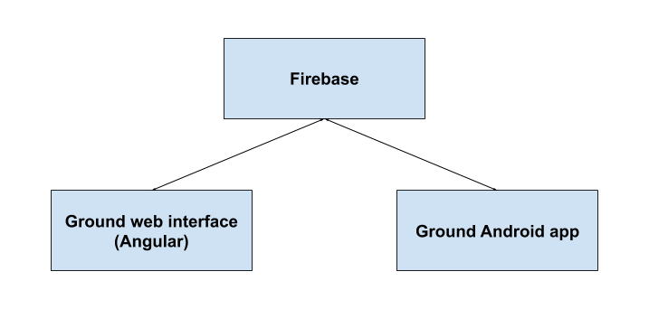

<!--
  Copyright 2021 Google LLC

  Licensed under the Apache License, Version 2.0 (the "License");
  you may not use this file except in compliance with the License.
  You may obtain a copy of the License at

      https://www.apache.org/licenses/LICENSE-2.0

  Unless required by applicable law or agreed to in writing, software
  distributed under the License is distributed on an "AS IS" BASIS,
  WITHOUT WARRANTIES OR CONDITIONS OF ANY KIND, either express or implied.
  See the License for the specific language governing permissions and
  limitations under the License.
-->

# Ground platform architecture

<!---
TODO: link to Android architecture docs after https://github.com/google/ground-android/pull/630 is merged.
-->
Ground is made up of three primary components: a [Firebase backend](architecture-docs/firebase-implementation-overview.md), an [Angular web app](architecture-docs/web-app-architecture.md), and a native Android app.

<!---
Editable diagram source:  https://docs.google.com/drawings/d/1xUtCkWZTDHkf77M_50EIO0n75LBitSad3pebvJM-jdw
-->

For more information Ground, also check out the [Key Concepts](https://github.com/google/ground-platform/wiki/Key-Concepts) and [Cloud Firestore Representation](https://github.com/google/ground-platform/wiki/Cloud-Firestore-Representation) pages in Ground platform Wiki.
