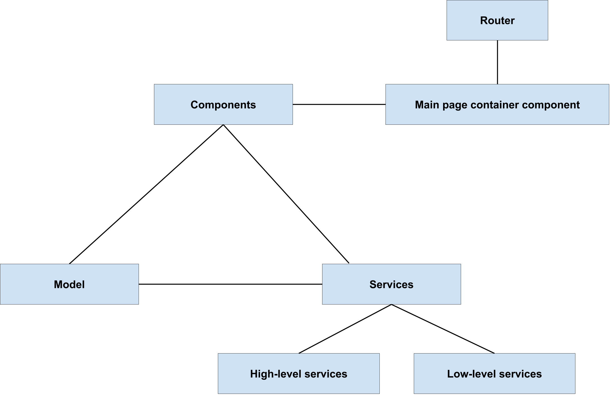

<!--
  Copyright 2021 Google LLC

  Licensed under the Apache License, Version 2.0 (the "License");
  you may not use this file except in compliance with the License.
  You may obtain a copy of the License at

      https://www.apache.org/licenses/LICENSE-2.0

  Unless required by applicable law or agreed to in writing, software
  distributed under the License is distributed on an "AS IS" BASIS,
  WITHOUT WARRANTIES OR CONDITIONS OF ANY KIND, either express or implied.
  See the License for the specific language governing permissions and
  limitations under the License.
-->

# Ground web app architecture

The Ground web app is written in TypeScript, using the [Angular](https://angular.io/) (not AngularJS) framework. The app uses the [functional reactive programming](https://en.wikipedia.org/wiki/Functional_reactive_programming) paradigm with the [RxJS](https://rxjs-dev.firebaseapp.com/guide/overview) library and unidirectional data streams. 

<!---
Editable diagram source: https://docs.google.com/drawings/d/1H4oAsWstQWA38uOxDKpZPFiKyltuACj9kkVD5UGbtT4/edit
-->

## Elements 

The web app is comprised of the following elements:

- **Components**: Elements in the UI are defined as [components](https://angular.io/guide/component-overview). 
    - **Main page container component**: All of the UI components in the main map view are grouped into the main page container component, which is called by the router when the app is loaded. For example, the [Google Maps Angular component](https://github.com/angular/components/tree/master/src/google-maps) draws the map elements.
- **Model**: The app model contains the objects that define the representations of the domain concepts, such as points, observations, surveys, location features, and geoJSON features.
- **Services**:
    - **High-level services**: Include `SurveyService` and `JobService`.
    - **Low-level services**: Include `DataStoreService` and `AuthService`.

## Data flows

- Components subscribe to Rx streams obtained from services. For example the map component subscribes to the `feature$` stream and updates the map when feature changes occur.
- Global streams, such the `activeSurvey$` stream in the `SurveyService` are used to represent shared app state.
