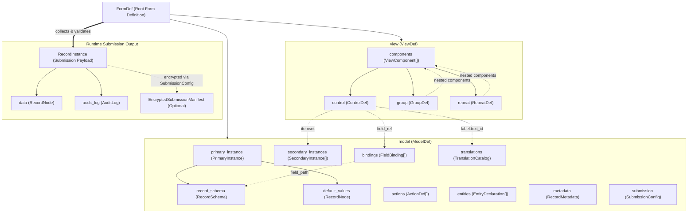

# Structure

A ProtoForms definition is organized around a root `FormDef` message containing
two principal sub-messages:

*   **`model`** (`ModelDef`):
    *   **`primary_instance`**: Defines the typed record schema and default
        values captured by the form.
    *   **`secondary_instances`**: Static or external lookup datasets for choice
        options and cascading selects.
    *   **`bindings`**: Rules for individual fields including *data type,
        required conditions, relevancy (skip logic), validation constraints,
        calculations, preloads,* and metadata mappings.
    *   **`translations`**: Multi-lingual text and media dictionaries.
    *   **`actions`**: Automated lifecycle event triggers (e.g. setting
        timestamps or geopoints on form load).
    *   **`entities`**: Declarations for creating or updating dataset entities
        upon submission.
    *   **`metadata`**: Standard form metadata header configuration, preloads,
        and audit parameters.
    *   **`submission`**: Submission endpoint, encryption key, and transmission
        policies.
*   **`view`** (`ViewDef`):
    *   Contains the display hierarchy and form controls (*inputs, selects,
        ranges, uploads, triggers, rankings, groups, and repeats*) required to
        render the form.



The following `textproto` snippet illustrates a complete ProtoForms definition
for a sample survey ("Survey Form"):

```textproto
# ProtoForms Form Definition (Text Format)

form_id: "survey_form"
title: "Survey Form"
version: "2025010101"

model {
  primary_instance {
    record_schema {
      fields {
        name: "given_name"
        type: TYPE_STRING
      }
      fields {
        name: "family_name"
        type: TYPE_STRING
      }
      fields {
        name: "years_active"
        type: TYPE_INT32
      }
    }
  }

  bindings {
    field_path: "given_name"
    type: TYPE_STRING
    required_expression: "true()"
  }
  bindings {
    field_path: "family_name"
    type: TYPE_STRING
  }
  bindings {
    field_path: "years_active"
    type: TYPE_INT32
  }
  bindings {
    field_path: "meta/instanceID"
    type: TYPE_STRING
    preload: PRELOAD_UID
  }
  bindings {
    field_path: "meta/instanceName"
    type: TYPE_STRING
    read_only: true
    calculate_expression: "concat(given_name, ' ', family_name)"
  }
}

view {
  components {
    control {
      field_ref: "given_name"
      type: CONTROL_INPUT
      label {
        text: "Enter given name:"
      }
    }
  }
  components {
    control {
      field_ref: "family_name"
      type: CONTROL_INPUT
      label {
        text: "Enter family name:"
      }
    }
  }
  components {
    control {
      field_ref: "years_active"
      type: CONTROL_INPUT
      label {
        text: "Years active:"
      }
    }
  }
}
```

Within this unified schema:

*   The form title, identifier, and version are first-class fields on `FormDef`.
*   External applications and intents are declared with typed `intent` controls
    and bindings.
*   Multi-lingual dictionaries are encapsulated inside `model.translations` (see
    [Languages](#languages)).
