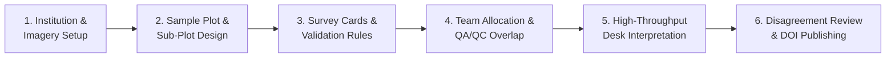

---
# Copyright 2026 The Ground Authors.
#
# Licensed under the Apache License, Version 2.0 (the "License");
# you may not use this file except in compliance with the License.
# You may obtain a copy of the License at
#
#     https://www.apache.org/licenses/LICENSE-2.0
#
# Unless required by applicable law or agreed to in writing, software
# distributed under the License is distributed on an "AS IS" BASIS,
# WITHOUT WARRANTIES OR CONDITIONS OF ANY KIND, either express or implied.
# See the License for the specific language governing permissions and
# limitations under the License.
onedoc_gdoc_url: https://docs.google.com/document/d/1aYEZItFSCmn1lziASTUM5YakNeaswvL65IuFDbzDgqY
onedoc_md_file_id: 225bf0c3-86f9-4e74-a646-28b3bf1acabc
onedoc_tab_id: t.o24u9v7vwav8
onedoc_tab_title: CEO Integration & Deltas
---

# Collect Earth Online Integration

**[SHARED EXTERNALLY]**

Authors: [@gmiceli](http://who/gmiceli) \
Last modified: [2026-09-24](google-date:2026-09-24T12:00:00Z)

## Overview

### Product Vision: Unifying Observation from Above with Verification on the Ground

Environmental monitoring, national forest inventories, and deforestation supply-chain audits (such as EUDR compliance) rely on two complementary modes of observation:

1. **Desk-Based Visual Interpretation ("From Above")**: Analysts inspect thousands of sample plots across high-resolution satellite imagery and historical vegetation time series in a desktop browser to classify land cover, land use, and forest disturbance at scale.
2. **In-Situ Field Validation ("On the Ground")**: Field crews, forest rangers, and agricultural extension agents travel to targeted sites with mobile devices to verify what satellite imagery cannot resolve—such as understory crops beneath closed tree canopy, persistent cloud shadow, early-stage forest degradation, or tenure boundaries.

Historically, **Collect Earth Online (CEO)** has served as the community standard for browser-based satellite visual interpretation, while **Ground** has served as the offline-first mobile tool for in-situ field data collection. Because the two tools operated as separate products with separate project setups and data formats, running a combined desk-and-field campaign required painful manual handoffs: exporting spreadsheets of ambiguous plots from CEO, cleaning and filtering them in desktop GIS software, creating a second survey in a mobile app, and manually reconciling two disconnected datasets weeks later.

Rolling Collect Earth Online into **Ground 2.0** eliminates this divide. By bringing satellite visual interpretation and mobile field validation into a single workspace around shared survey sites, a plot flagged by a desk interpreter on a laptop in the morning can immediately appear as a high-priority validation target on a field ranger's offline phone that afternoon—closing the loop between satellite observation and ground truth.

> **Terminology & Parity**: See **[Terminology & Cross-Platform Parity](terminology.md)** for the complete mapping between Collect Earth Online (CEO) and Ground 2.0 concepts (e.g., CEO **Institution** $\rightarrow$ Ground **Organization**; CEO **Project** $\rightarrow$ Ground **Survey**; CEO **Survey Cards** $\rightarrow$ Ground **Form & Groups**; CEO **Plots & Samples** $\rightarrow$ Ground **Relational Layers/Tables**).

### Primary Personas & Jobs-to-be-Done

| Persona | Primary Environment | Core Jobs-to-be-Done in the Unified Platform |
| :--- | :--- | :--- |
| **Survey Organizer / GIS Lead** | Web Console (Desktop Browser) | Define study areas and statistical sample designs; configure satellite basemaps and historical time-series charts; design questionnaires and validation rules; assign plots across desk interpreters and field teams; monitor quality and agreement; publish verified datasets. |
| **Desk Photo-Interpreter** | Web Console (Desktop Browser) | Step rapidly through assigned sample plots; compare multi-date satellite imagery and vegetation indices; label sub-plot sample points or draw features; record interpretation confidence; flag ambiguous or cloud-obstructed plots for supervisor review or mobile field visits. |
| **Field Validator / Community Ranger** | Mobile App (Android & iOS, Offline) | Sync only the plots requiring in-person verification in their operating area; review the desk analyst's observations and reason for flagging; hike to the plot using offline compass bearing and distance navigation; capture ground-truth classifications, under-canopy GPS perimeters, and verification photos. |
| **QA/QC Supervisor / Subject Matter Expert (SME)** | Web Console (Desktop Browser) | Monitor interpreter progress and agreement rates; inspect side-by-side disagreements across multiple analysts or external reference models; adjudicate disputed plots; route unresolved ambiguities to field crews; exclude uncalibrated contributors without losing historical records. |

## Collect Earth Online Capabilities: User Experience Inventory

To ensure existing Collect Earth Online institutions and users can transition seamlessly to Ground 2.0, this section catalogs the complete set of user-facing capabilities available in [Collect Earth Online](https://www.collect.earth/ceo-guides/) today across the lifecycle of an interpretation campaign.



### Institution Workspaces & Shared Imagery Libraries

Users in Collect Earth Online organize their work inside **Institutions** (representing a ministry of forestry, university lab, NGO, or research consortium):

* **Role-Based Membership**: Institution Administrators manage the organization profile and logo, approve or invite members, and control who can create projects or view restricted campaigns.
* **Institutional Imagery Catalogs**: Administrators configure reusable satellite imagery connections once at the institution level so project creators do not have to manage API keys or tile URLs repeatedly. Imagery layers can be marked **Private** (visible only to verified institution members, even when used inside a public project) or **Public** (available to any contributor).
* **Protected Credential Sharing**: When an institution connects commercial or subscription imagery (such as Planet NICFI/Daily, Maxar SecureWatch, or secured GeoServer layers), members and external interpreters can view the imagery on the map during data collection without ever seeing or downloading the underlying institutional API keys.

### Campaign Creation, Templates, & Public Crowdsourcing Modes

Organizers have four ways to launch a visual interpretation campaign:

* **Guided Creation Wizard**: A step-by-step setup covering project metadata, privacy controls (Public, Institution Members, Assigned Users Only, or Private), area of interest, plot and sample layout, imagery selection, questionnaire cards, validation rules, and Geo-Dash auxiliary charts.
* **Project Templates**: Organizers can clone any existing institutional or public campaign—copying its questionnaire cards, validation rules, Geo-Dash widgets, and optionally its exact spatial plot and sample layout—to run consistent multi-year monitoring or regional replications.
* **Collect Earth Desktop (`.cep`) Migration**: Organizers transitioning from the desktop Collect Earth tool can upload a `.cep` archive to automatically generate web survey cards, validation rules, and plot grids.
* **Simplified "No-Login" Collection Projects**: For citizen-science campaigns, rapid student mapathons, or open crowdsourcing, organizers can launch a **Simplified Project** shared via a direct web link. Guest contributors can accept an open-data license prompt (CC-BY-4.0) and immediately begin drawing and labeling features inside the study area without creating an account.

### Two-Tier Spatial Sampling: Plots and Sub-Plot Samples

Unlike standard field surveys that treat a site as a single pin or boundary, Collect Earth Online uses a **two-tier spatial hierarchy**—**Plots** and **Sub-Plot Samples**—designed specifically for estimating fractional land-cover composition:

* **Area of Interest (AOI)**: Organizers define the study area by entering bounding coordinates, drawing a box on the map, or uploading a multi-polygon boundary file (Shapefile, GeoJSON, or CSV).
* **Plot Layout & Shapes**: Within the AOI, organizers generate **Sample Plots** using:
  * **Systematic Grids**: Evenly spaced plots at a fixed distance (in meters), with optional randomized ordering so analysts do not interpret adjacent landscapes sequentially.
  * **Random Sampling**: A target number of plots distributed randomly across the AOI with an enforced minimum separation distance.
  * **Custom Imported Plots**: Pre-designed plot centers or boundaries uploaded from statistical design tools, preserving any extra reference columns (such as ecological stratum, district, elevation, or prior-year land cover).
  * **Plot Geometry**: Plots are displayed as **Squares** or **Circles** of a specified width or diameter (for example, a $100\text{m} \times 100\text{m}$ plot).
* **Sub-Plot Sample Points & User-Drawn Geometries**: Inside each plot boundary, organizers configure how interpreters record observations:
  * **Point Grids or Random Points**: A plot can contain a grid of internal sample points (for example, a $5 \times 5$ grid of 25 points spaced $20\text{m}$ apart) or a single center point. During interpretation, the analyst classifies individual sample points inside the plot—for instance, labeling 18 points as *Forest* and 7 points as *Cropland*—allowing the system to automatically calculate that the plot has **72% Forest cover and 28% Cropland cover**.
  * **User-Drawn Samples**: Alternatively, organizers can disable pre-defined sample points and instruct analysts to digitize custom **Points**, **Lines**, or **Polygons** directly inside the plot boundary (such as tracing newly built logging roads, buildings, or clearings).

### Visual Survey Cards, Color Swatches, & Domain Validation Rules

Questionnaires in Collect Earth Online are optimized for visual spatial labeling rather than long text entry:

* **Survey Cards & Fast Input Controls**: Questions are grouped into collapsible **Survey Cards** using high-speed input controls: clickable **Buttons** (single-click selection), **Radio Buttons**, **Dropdown Menus**, and short **Text/Numeric Inputs**.
* **Color-Coded Answers on the Map**: Every answer choice requires a distinct **Color Swatch**. As an interpreter assigns answers to sub-plot sample points or drawn polygons, those points immediately change to the corresponding answer's color on the satellite map—giving the analyst instant visual feedback on which points have been labeled and how land cover is distributed across the plot.
* **Parent-Child Conditional Questions**: Selecting a broad land-cover class (e.g., *Forest*) dynamically reveals child follow-up questions (e.g., *Forest Type: Primary, Secondary, Plantation* and *Disturbance Type*). When editing a live campaign, organizers can hide obsolete questions or answers without corrupting already-collected data.
* **Six Built-In Quality Validation Rules**: Organizers can attach real-time validation rules that prevent an analyst from saving a plot until satisfied:
  1. **Sum of Answers**: Requires two or more numeric questions to add up to an exact target (most commonly ensuring that estimated percentages of *Tree Cover*, *Shrub*, *Crop*, and *Bare Ground* sum to exactly **100%**).
  2. **Matching Sums**: Requires the sum of one group of numeric questions to equal the sum of another group (for example, ensuring total land area in 2020 equals total land area in 2026 across transition categories).
  3. **Incompatible Answers**: Prevents logically contradictory choices across two questions (for example, preventing *Land Cover = 0% Tree Canopy* when *Land Use = Dense Primary Forest*).
  4. **Multiple Incompatible Answers**: Prevents combinations of three or more mutually exclusive conditions across multiple cards.
  5. **Numeric Range**: Restricts numeric inputs to a valid minimum and maximum range.
  6. **Text Pattern Match**: Validates text inputs against a required format (such as standardized plot codes or species identifiers).

### Work Allocation, Blind QA/QC Overlap, & Plot Locking

To coordinate large teams of analysts without duplicate effort or bias, organizers configure work distribution and quality control rules:

* **Team Work Allocation**: Plots can be left in an open shared pool, divided **Equally** across selected team members, assigned by **Custom Percentage** (giving full-time interpreters a larger share than part-time reviewers), or mapped per plot from an uploaded roster file.
* **Automated QA/QC Review Modes**:
  * **Peer Overlap Review**: Organizers specify a percentage of each interpreter's plots (e.g., 15%) and how many additional peers ($K$ reviewers) must independently interpret those same plots to measure inter-annotator agreement.
  * **Subject Matter Expert (SME) Review**: A designated percentage of each interpreter's plots is automatically routed to senior forestry or remote-sensing specialists for expert verification.
* **Automatic 5-Minute Plot Locking**: Whenever an interpreter opens an unassigned plot, the system places a temporary **5-minute lock** on that plot (automatically renewed while the user remains active) so no other team member accidentally works on the same plot at the same time.
* **Eight Queue Navigation Modes**: Analysts and supervisors can filter and step through plots using eight dedicated queue modes:
  1. **Default Assigned Queue**: Automatically steps to the user's next assigned, unanalyzed plot.
  2. **Unanalyzed Plots**: All remaining unvisited plots.
  3. **Analyzed Plots**: Previously completed plots for self-review or correction.
  4. **Flagged Plots**: Plots marked as problematic or ambiguous.
  5. **Low-Confidence Plots**: Plots where the interpreter recorded a confidence score below a chosen threshold (e.g., $\le 50\%$).
  6. **By Interpreter**: Filters to plots completed by a specific team member for targeted coaching.
  7. **High-Disagreement Plots (QA/QC)**: Filters to overlap plots where interpreter disagreement exceeds a supervisor-selected percentage (e.g., $\ge 30\%$ disagreement).
  8. **Visually Similar Plots (GeoAI)**: Steps through the 50 plots across the project whose satellite embeddings look most similar to a chosen reference plot, helping analysts rapidly find and label rare land-cover classes.

### High-Throughput Interpretation Workspace & Analyst Aids

The desktop collection screen is purpose-built for analysts labeling hundreds of plots per day:

* **Multi-Point Map Selection**: Analysts can click a single sample point, hold `Ctrl`/`Cmd` or drag a selection box around a cluster of points to label them all with a single click, or let the cursor automatically advance to the next unlabeled sample point.
* **Visual Percentage Estimation Grid**: Analysts can toggle an on-screen **Map Grid** overlaid on the plot to visually estimate fractional canopy or land-cover percentages, as well as hide plot boundaries or sample points momentarily to inspect subtle features on the underlying imagery.
* **Multi-Temporal Imagery & Date-Stack Switching**: Analysts can switch between configured basemaps, step through specific historical acquisition dates (such as monthly tropical mosaics or daily cloud-free scenes), and automatically record which exact imagery layer and acquisition date was used for each sample answer.
* **Confidence Rating & Commentary**: Before saving a plot, the analyst can adjust a **Confidence Slider (`0–100%`)** and leave an optional note explaining any uncertainty.
* **Plot Flagging**: If a plot is obscured by thick clouds, missing imagery, or cannot be reliably classified from space, the analyst can click **Flag Plot** and enter a reason.
* **External Earth Viewers & Embedded Reference Guides**: Analysts can download a one-click **Plot KML** to inspect 3D terrain and historical imagery in Google Earth Desktop/Web, or open the organizer's embedded **Learning Material** guide (containing classification keys and example satellite chips) without leaving the collection screen.

### Geo-Dash: Synchronized Historical Time-Series & Degradation Analysis

When a single satellite snapshot is not enough to tell whether land is seasonal cropland, deciduous woodland, or recently degraded forest, Collect Earth Online automatically opens a synchronized **Geo-Dash** window alongside the map:

* **Plot-Synchronized Spectral Charts**: As the interpreter moves from plot to plot, Geo-Dash automatically charts multi-year vegetation and moisture indices (**NDVI, EVI, EVI2, NDMI, NDWI, NBR**) and **Dynamic World** land-cover probabilities for that exact plot boundary.
* **Interactive Forest Degradation Tool (NDFI & SAR)**: Analysts can inspect a multi-decade Normalized Difference Fraction Index (NDFI) or radar time series. **Clicking any point or sudden drop on the historical graph immediately loads the corresponding historical satellite image chip (`RGB` or `SWIR/NIR/Red` false color) above the chart**, allowing the analyst to visually verify the exact month a logging event, fire, or clearing occurred.
* **Dual Imagery Comparison**: Displays side-by-side imagery panels inside the dashboard so analysts can compare two different sensors or years simultaneously.

### QA/QC Dashboard, Convergence of Evidence, & Dataset Publishing

For project supervisors, Collect Earth Online provides a comprehensive review and publishing suite:

* **Convergence of Evidence (Peer Consensus vs. External Reference Data)**: Supervisors can evaluate disagreement in two ways:
  1. **Peer Consensus**: Compares each interpreter's answers against the majority (most frequent) answer across all analysts who reviewed the plot.
  2. **External Source of Truth (SoT)**: Organizers can upload an external reference dataset (such as pre-existing field inventory plots or predictions from an AI land-cover model) to automatically measure where human interpreters disagree with the reference data.
* **Side-by-Side Disagreement Inspection & Contributor Quarantine**: Supervisors can view a side-by-side breakdown of how each analyst labeled every sample point in a disputed plot. If an interpreter is found to be poorly calibrated or submitting low-effort labels, the administrator can **Ignore/Disable User Contributions**—excluding that user's labels from project statistics and final exports with a single toggle, while preserving their raw records for auditability.
* **Two-Level Exports & Zenodo DOI Minting**: Organizers can export both a **Plot Summary CSV** (containing aggregated percentage cover per class, confidence scores, and interpretation duration) and a **Raw Sample CSV** (every individual sub-plot point and the exact imagery date used). When the campaign is complete, organizers can mint an official **Digital Object Identifier (DOI)** via built-in **Zenodo / DataCite** integration, packaging the dataset and automatically crediting all participating interpreters as data curators.

## Integrating Collect Earth Online with Ground 2.0: The Unified User Experience

### How Visual Interpretation Fits Naturally into Ground 2.0

In Ground 2.0, visual interpretation is not a separate application bolted onto the side of field collection; both workflows share the same core building blocks:

* **Sample Plots are Shared Survey Sites**: A campaign's sample plots live in a shared **Map features** table. Each plot has a location/boundary, reference attributes (such as stratum or region), and a live **Status** (for example: *Pending Desk Review* $\rightarrow$ *Flagged for Field Validation* $\rightarrow$ *Field Verified*).
* **Desk and Field Questionnaires are Standard Forms**: A survey can include both a **Desk Visual Interpretation Form** (completed in the Web Console) and a **Field Validation Form** (completed in the Mobile App), both linked to the same sample plots.
* **Map Pins Reflect Real-Time Campaign Progress**: As plots move through desk interpretation and field verification, their map markers automatically change color and icon across both the Web Console and Mobile App.

### Base Case User Journey: Flagging Sample Plots During Visual Inspection for Field Validation

The highest-value integration between Collect Earth Online and Ground 2.0 is the **Desk-to-Field Validation Loop**: allowing a photo-interpreter to flag an ambiguous sample plot during visual inspection so that a mobile field crew can physically visit and verify that exact location on the ground.

```mermaid
sequenceDiagram
    autonumber
    actor Desk as Desk Interpreter<br/>(Web Console)
    participant Platform as Ground 2.0 Shared<br/>Plot Registry
    actor Field as Field Validator<br/>(Mobile App — Offline)
    actor Lead as Survey Supervisor<br/>(Web Console)

    Note over Desk,Platform: Step 1: Desk Visual Inspection & Flagging
    Desk->>Platform: Opens Plot #1042 ("Pending Desk Review")
    Desk->>Platform: Enters preliminary call ("Probable Shade Cocoa"), sets Confidence = 35%
    Desk->>Platform: Flags plot for Field Validation:<br/>"Closed upper canopy obscures understory; verify cocoa trees vs. secondary forest"
    Note right of Platform: Plot #1042 automatically updates:<br/>• Status: "Needs Field Validation"<br/>• Map Pin: Red Alert ("!")<br/>• Preliminary call & note preserved

    Note over Platform,Field: Step 2: Targeted Mobile Sync & Field Navigation
    Field->>Platform: Syncs Mobile App before heading to district
    Platform->>Field: Downloads only plots marked "Needs Field Validation" in district
    Field->>Field: Taps Red "!" Pin #1042 on offline map;<br/>reads Desk Interpreter's note & 35% confidence call
    Field->>Field: Uses Wayfinding HUD (bearing & distance) to hike to Plot #1042

    Note over Field,Lead: Step 3: In-Situ Ground-Truthing & Closed-Loop Resolution
    Field->>Platform: Records under-canopy GPS boundary, 4 cardinal photos, & Ground Truth ("Shade-Grown Cocoa")
    Note right of Platform: Plot #1042 automatically updates:<br/>• Status: "Field Verified"<br/>• Map Pin: Green Check ("✓")
    Platform->>Lead: Displays side-by-side Satellite View + Field Photos for final QA & team calibration
```

#### Step 1: Desk Visual Inspection & Non-Destructive Flagging (Web Console)

1. A desk photo-interpreter logs into the Ground 2.0 Web Console and launches the **Visual Interpretation Workspace** for a national cocoa and forest monitoring survey.
2. On Plot #1042, the interpreter inspects high-resolution satellite imagery and the historical vegetation timeline. They see a dense upper tree canopy with faint linear clearing patterns underneath, making it impossible to tell from satellite imagery alone whether the plot is **natural secondary forest** or **shade-grown agroforestry cocoa**.
3. Rather than guessing blindly—or throwing away their observations as required in standalone CEO—the interpreter:
   * Selects their best preliminary assessment (*Shade-Grown Cocoa*),
   * Slides their **Interpretation Confidence** to **35%**,
   * Toggles **Flag for Field Validation**, and types a brief instruction for the field team: *"Dense upper canopy obscures understory rows; please verify whether planted cocoa trees are present beneath canopy."*
4. When the interpreter clicks **Save & Next Plot**, Ground 2.0 preserves their preliminary classification and confidence score, updates Plot #1042's status to **Needs Field Validation**, and changes its map pin to a high-visibility red alert marker (`!`).

#### Step 2: Automatic Field Dispatch & Selective Offline Sync (Mobile App)

1. A national campaign may contain 50,000 sample plots across the country, of which only 300 ambiguous plots are flagged for physical field visits.
2. When a field ranger or extension agent opens the Ground 2.0 Mobile App before heading into the field, their **Field Validation** workflow is automatically filtered to display only plots whose status is **Needs Field Validation** within their operating region.
3. The ranger downloads offline basemap tiles for their district and heads into the field with zero manual spreadsheet imports or file transfers.

#### Step 3: Context-Aware Ground-Truthing & Wayfinding Under Canopy (Mobile App)

1. Operating completely offline in the forest reserve, the ranger sees the red `!` marker for Plot #1042 on the Mobile App map and taps it.
2. The site card immediately displays the **Desk Context Banner**:
   > **Flagged for Field Validation (Desk Confidence: 35%)**
   > *Preliminary Desk Classification*: Shade-Grown Cocoa
   > *Interpreter Note*: "Dense upper canopy obscures understory rows; please verify whether planted cocoa trees are present beneath canopy."
3. The ranger taps **Navigate to Site**, activating Ground 2.0's top-docked **Wayfinding HUD** (live compass bearing and straight-line distance) to hike directly to the plot center.
4. Once inside the plot, the ranger launches the **Field Validation Form**, captures a high-accuracy GNSS perimeter walk under the canopy, takes four cardinal-direction reference photos of the understory and upper canopy, and records the verified ground-truth classification (*Shade-Grown Cocoa — Mature Understory*).

#### Step 4: Closed-Loop Verification & Team Calibration (Web Console)

1. As soon as the ranger's device reconnects to a cellular or Wi-Fi network, the field validation submission syncs to the cloud.
2. Plot #1042's status automatically transitions to **Field Verified**, and its map marker updates to a green checkmark (`✓`) across both mobile and web maps.
3. Back in the Web Console, the QA/QC Supervisor—and the original desk interpreter—can open Plot #1042 to view the field ranger's understory photos alongside the satellite imagery and spectral charts. These field-verified plots can then be pinned to the campaign's **Learning Materials** or used as a **Source of Truth (SoT)** reference dataset to calibrate the entire photo-interpretation team on what shade-grown cocoa looks like from space.

## Product & Workflow Deltas from the Current Ground 2.0 PRD

While the current Ground 2.0 Product Requirements Document ([`prd.md`](prd.md)) and Concept Brief ([`concept-brief.md`](concept-brief.md)) establish the foundation for rolling Collect Earth Online into Ground 2.0, a detailed comparison against Collect Earth Online's capabilities reveals **12 product and workflow deltas** that must be incorporated into the Ground 2.0 requirements to support real-world interpretation and desk-to-field campaigns.

### Summary of Product Deltas

| # | Product Area | What Users Can Do in CEO Today | Current Ground 2.0 PRD Baseline | Product Requirement Delta for Ground 2.0 |
| :---: | :--- | :--- | :--- | :--- |
| **1** | **Within-Plot Sample Point Grids & Proportional Cover** | Analysts select and label multiple sub-plot sample points (e.g., 25 points inside a $100\text{m}$ plot) on the map; the system automatically calculates fractional land-cover percentages (e.g., 72% Forest, 28% Crop). | Sites are modeled as a single point, line, or polygon where a form submission applies to the site as a whole. No UI workflow is specified for multi-selecting sub-plot sample points on the map. | **Add Sub-Plot Sample Grid & Map Multi-Select UX**: Allow organizers to configure sub-plot point grids (gridded, random, center) or multi-feature drawing inside a plot, allow analysts to click/box-select subsets of points on the map to assign answers, and auto-calculate plot-level percentage rollups. |
| **2** | **Non-Destructive Plot Flagging & Confidence Ratings** | Analysts can rate confidence (`0–100%`) OR flag a plot with a reason—but flagging a plot in CEO **deletes** all partial sample answers (`flagged` and `saved` are mutually exclusive). | Mentions that interpreters can flag ambiguous plots for review, but does not specify how flagged plots retain preliminary observations or hand off context to field teams. | **Require State-Preserving Plot Flagging**: Allow desk interpreters to save their preliminary classification AND confidence rating (`0–100%`) while flagging a plot for either **Supervisor Review** or **Mobile Field Validation**, surfacing the desk hypothesis and flag note on the mobile field card. |
| **3** | **Multi-Interpreter Consensus vs. Offline Sync Conflict Queue** | Supervisors compare independent labels from $K$ overlapping interpreters using **Peer Majority Consensus** or an **External Source of Truth (SoT)** dataset, routing plots with high disagreement to adjudication. | Assumes multi-interpreter disagreement resolution reuses the **Offline Sync Conflict Queue**, which only triggers when two offline devices edit the same site simultaneously and auto-resolves via *Latest Timestamp Wins*. | **Dedicated Multi-Interpreter Consensus & Disagreement Workflow**: Treat multi-interpreter reviews as independent assessments rather than offline sync conflicts; automatically compute peer agreement % and SoT accuracy, and automatically route plots exceeding a disagreement threshold to SME adjudication or Field Validation. |
| **4** | **Campaign Scale Quotas & Selective Mobile Sync** | National inventories routinely host **20,000 to 100,000+ sample plots**, **100+ student/agency interpreters**, complex multi-vertex boundaries, and multi-page illustrated interpretation keys. | Sponsored Tier limits surveys to **10,000 sites**, **50 users**, **50 vertices per polygon**, and **255-character descriptions**, and syncs all survey sites to mobile devices. | **Scale Quotas & Filtered Field Sync**: Expand enterprise/sponsored limits to **100,000+ plots**, **500+ contributors**, **2,500+ polygon vertices**, and rich Markdown **Learning Materials**, while allowing the Mobile App to sync **only** the subset of plots flagged for field validation in the user's region. |
| **5** | **Work Allocation, Overlap Rules, & 5-Minute Plot Locking** | Organizers split plots across interpreters (equal, %, or roster file), configure peer overlap % (`N` reviews per plot) and SME review %, and prevent collisions via automatic **5-minute active plot locks**. | Task assignment and work routing are deferred to [`future-work.md`](future-work.md), and no active plot locking mechanism is specified for shared online pools. | **Bring Plot Locking & Overlap Assignment into Core**: Implement automatic 5-minute active plot locking so concurrent analysts never interpret the same unassigned plot twice, alongside organizer controls for equal/percentage split, peer overlap %, and SME review routing. |
| **6** | **Institutional Imagery Catalogs & Credential Protection** | Institutions configure private/public satellite layers (Planet Daily/NICFI, Maxar SecureWatch, GEE, WMS/WMTS) with a **server-side credential proxy** so analysts can view commercial tiles and date stacks without seeing API keys. | Defines vector map layers, but does not specify institutional basemap catalogs, credential proxying for commercial imagery keys, or plot-level date-stack selectors. | **Add Institutional Imagery Catalog & Credential Proxy**: Allow organizations to register authenticated satellite tile services whose API keys remain hidden on the server, expose interactive date-stack selectors to interpreters, and record the active imagery layer and acquisition date on every saved label. |
| **7** | **Color-Coded Answer Swatches & Visual Validation Rules** | Every answer choice has a color swatch that dynamically colors labeled sample points on the map, backed by 6 visual rule templates (`Sum of Answers = 100%`, `Matching Sums`, `Incompatible Answers`, etc.). | Form choices are styled at the layer/dataset level rather than per answer option, and complex cross-question constraints require authoring raw formula expressions. | **Add Answer Color Swatches & No-Code Validation Templates**: Allow organizers to assign a color swatch to each answer option (dynamically coloring sub-plot sample points as they are answered) and provide guided rule templates for `Sum to 100%`, `Matching Sums`, and `Incompatible Answers`. |
| **8** | **Inline Geo-Dash & Click-to-Load Historical Imagery** | Synchronized second browser window displaying GEE vegetation time series (NDVI, EVI, NDWI) and a Forest Degradation (NDFI/SAR) chart where clicking a graph point loads that historical date's satellite image chip. | Mentions rendering per-plot indicator time-series panels in a single bullet, without detailing interactive historical image chip retrieval or layout configuration. | **Embed Geo-Dash as an Inline Dockable Workspace Panel**: Provide a configurable, dockable time-series and Forest Degradation (NDFI/SAR) drawer directly inside the single Web Console window (eliminating browser pop-up blockers) where clicking any date on a spectral chart loads that historical satellite scene onto the main map. |
| **9** | **Specialized Queue Filters & GeoAI Plot Similarity** | Analysts can step through plots using 8 queue modes—including **Flagged**, **Low Confidence ($\le X\%$)**, **High Disagreement ($\ge Y\%$)**, and **Visually Similar Plots (GeoAI satellite embeddings)**. | Outlines basic sequential plot navigation, while deferring AI-assisted workflows to [`future-work.md`](future-work.md). | **Support Multi-Mode Queue Filtering & Similarity Search**: Provide queue filter presets for Unanalyzed, Flagged, Low Confidence, Specific Interpreter, High Disagreement, and Visually Similar plots (leveraging satellite embeddings to accelerate rare-class discovery). |
| **10** | **Contributor Quarantine (`Ignore User`) & Source-of-Truth Scoring** | Supervisors can upload an external reference file (SoT) to grade interpreter accuracy and toggle **Ignore/Disable User** to exclude uncalibrated contributors from stats and exports without deleting records. | Supports deleting individual submissions, but lacks a non-destructive contributor quarantine toggle or batch comparison against an external reference dataset. | **Add Non-Destructive Contributor Quarantine & Reference Grading**: Allow supervisors to toggle a contributor's submissions out of consensus calculations and exports without deleting audit history, and compare interpreter labels against uploaded reference or field-verified datasets. |
| **11** | **Public "No-Login" Collection Links & `.cep` Import** | Supports unauthenticated guest collection via a simplified project link (`/simple-collection`) with a CC-BY-4.0 license prompt, plus legacy Collect Earth Desktop (`.cep`) import. | Requires authenticated user accounts listed in survey access controls and focuses migration exclusivamente on CEO web projects. | **Support Optional Guest Crowdsourcing Links & `.cep` Migration**: Allow organizers to enable public guest links (with open-data license acceptance) for citizen-science mapathons, and provide a `.cep` desktop project importer alongside the CEO migration tool. |
| **12** | **One-Click Zenodo / DataCite DOI Publishing** | Organizers can package campaign plots, sample points, questionnaires, and collected labels into a permanent **Zenodo / DataCite DOI** directly from the project dashboard, automatically crediting all interpreters. | Supports CSV, GeoJSON, and Shapefile downloads, but has no direct academic/open-data repository publishing workflow. | **Add Open-Science DOI Publishing Integration**: Provide a one-click export to Zenodo / DataCite that bundles plot summaries, sub-plot sample observations, imagery provenance, and field verification records with automatic contributor attribution. |

### Detailed Product Requirements for the Top User Workflow Deltas

#### 1. Within-Plot Sample Point Grids & Map-Driven Labeling
In land-use and forest inventories, a sample plot (such as a half-hectare or one-hectare square) rarely consists of a single uniform land cover. Photo-interpreters need to estimate what percentage of the plot is covered by trees, shrubs, crops, roads, or water.
* **User Experience Requirement**:
  * When setting up a visual interpretation survey, the organizer can choose whether each plot is evaluated as a **Whole Plot** or subdivided into **Sub-Plot Sample Points** (e.g., a $3 \times 3$, $5 \times 5$, or $7 \times 7$ grid of internal points, random internal points, or user-drawn sub-features).
  * During interpretation, the analyst selects one or more sample points directly on the map (via single click, `Shift`/`Ctrl`-click, or box-drag selection) and clicks an answer button (e.g., *Closed Forest*).
  * Selected points immediately turn the color of that answer choice on the map, and the cursor automatically advances to the next unlabeled sample point in the plot.
  * When all sample points in the plot are labeled, the platform automatically computes the plot-level fractional cover percentages (e.g., *68% Closed Forest, 20% Shade Cocoa, 12% Bare Soil*) for downstream reporting and field comparison.

#### 2. Non-Destructive Plot Flagging & Confidence Handoff
In Collect Earth Online today, if an interpreter spends three minutes analyzing a difficult plot and decides to flag it, the system erases all of their answers on that plot. When integrating with mobile field teams in Ground 2.0, throwing away the desk analyst's partial observations deprives the field crew of critical context.
* **User Experience Requirement**:
  * Every visual interpretation form includes a built-in **Confidence Slider (`0–100%`)** and a **Flag Plot** action.
  * When flagging a plot, the interpreter selects the destination (**Flag for Supervisor / SME Review** vs. **Flag for Mobile Field Validation**) and provides a brief note explaining what is uncertain (e.g., *"Cloud shadow on northeast quadrant"* or *"Cannot distinguish coffee/cocoa understory from bush fallow"*).
  * Any preliminary answers entered by the interpreter are **saved alongside the flag**, and are displayed as a read-only summary banner on the supervisor's review screen and on the field ranger's mobile device.

#### 3. Multi-Interpreter Consensus vs. Offline Sync Conflict Resolution
The current Ground 2.0 PRD proposes reusing the **Offline Sync Conflict Queue** to handle disagreement between multiple photo-interpreters. From a user's perspective, however, an offline sync conflict and a multi-interpreter QA/QC review are fundamentally different:
* An **Offline Sync Conflict** happens accidentally when two field rangers edit the same property of a site while disconnected, and is resolved by picking one edit (*Latest Timestamp Wins*).
* A **Multi-Interpreter QA/QC Review** is an intentional statistical workflow where an organizer assigns 3 or 5 analysts to independently classify the same plot online so the platform can measure agreement and compute a consensus label. If *Latest Timestamp Wins* were applied, the 3rd interpreter's submission would simply overwrite the 1st and 2nd interpreters' work.
* **User Experience Requirement**:
  * When a plot is configured for multi-interpreter overlap (e.g., 3 independent reviews required), each interpreter sees the plot in a clean, unanalyzed state so their judgment is not biased by prior analysts.
  * Once the required number of independent interpretations is reached, Ground 2.0 automatically evaluates agreement:
    * **Full Agreement**: The consensus classification is automatically promoted as the verified desk label for the plot.
    * **Disagreement Above Threshold**: The plot is automatically routed to the **Disagreement Review Queue** (for side-by-side supervisor adjudication) or—if configured by the organizer—automatically transitioned to **Needs Field Validation** so a mobile crew can settle the tie on the ground.

#### 4. Scaling to National Inventories with Selective Mobile Sync
National remote-sensing campaigns operate at a vastly larger site count than purely mobile surveys: a national grid routinely contains **25,000 to 100,000 sample plots** interpreted by **50 to 300 analysts**, whereas mobile field teams may only physically visit **1% to 5%** of those plots (the ones flagged for ambiguity or selected for ground-truth calibration).
* **User Experience Requirement**:
  * Allow visual interpretation campaigns in Ground 2.0 to host up to **100,000+ sample plots** and **500+ collaborators** in the Web Console.
  * Ensure the Mobile App does **not** attempt to download all 100,000 desk plots to a ranger's phone; instead, mobile devices automatically sync only the plots assigned to field validation (e.g., plots marked *Needs Field Validation* within the ranger's geographic region), keeping offline mobile sync fast and lightweight.

#### 5. Inline Dockable Geo-Dash with One-Click Historical Imagery
In Collect Earth Online, Geo-Dash opens as a separate pop-up browser window—which is frequently blocked by modern browsers and difficult to manage on single-monitor laptops.
* **User Experience Requirement**:
  * Integrate **Geo-Dash** directly into the Ground 2.0 Web Console as a collapsible, resizable **Time-Series & Degradation Drawer** (with an option to pop it out onto a second monitor if desired).
  * Preserve CEO's signature **Interactive Forest Degradation workflow**: when an analyst clicks any point or disturbance dip on a multi-year vegetation or radar time-series chart (such as NDVI, EVI, or NDFI), the main map viewport immediately loads the corresponding historical satellite image from that exact month and year so the analyst can visually confirm the event.

## Recommended Rollout Phases for Users & Institutions

```mermaid
flowchart LR
    subgraph Phase1["Phase 1: Desk-to-Field Validation Loop"]
        P1A["Shared Plot Table Across Web & Mobile"]
        P1B["State-Preserving Plot Flagging & Confidence (0-100%)"]
        P1C["Selective Mobile Sync & Field Context Banner"]
        P1D["5-Min Active Plot Locking & 100k Plot Scale"]
    end

    subgraph Phase2["Phase 2: Full Multi-Interpreter & Sub-Plot Parity"]
        P2A["Sub-Plot Sample Point Grids & Auto-% Rollups"]
        P2B["Blind Overlap Assignment & Disagreement Dashboard"]
        P2C["Institutional Imagery Catalogs & Credential Proxy"]
        P2D["Color-Coded Answer Swatches & Sum-to-100% Rules"]
    end

    subgraph Phase3["Phase 3: Historical Time-Series, GeoAI, & Open Science"]
        P3A["Inline Geo-Dash Drawer & Click-to-Load Historical Chips"]
        P3B["GeoAI Visually Similar Plot Queue"]
        P3C["Public Guest Collection Links & Zenodo DOI Minting"]
    end

    Phase1 --> Phase2 --> Phase3
```



1. **Phase 1 — Desk-to-Field Validation Loop (Immediate Priority)**:
   * Enable shared plot registries across the Web Console and Mobile App so desk analysts can classify plots, record confidence (`0–100%`), and flag ambiguous or cloud-covered plots for **Mobile Field Validation** while preserving their preliminary call and notes.
   * Deliver selective mobile sync (downloading only flagged field-validation plots to mobile devices), the mobile **Desk Context Banner**, 5-minute active plot locking, and expanded campaign limits (100,000+ plots).
2. **Phase 2 — Full Multi-Interpreter & Sub-Plot Campaign Parity**:
   * Introduce within-plot **Sub-Plot Sample Point Grids** with map box-selection and automatic plot-level percentage rollups.
   * Launch **Blind Multi-Interpreter Overlap** and **Subject Matter Expert (SME)** assignment rules, the **Disagreement & Source-of-Truth Review Dashboard**, **Institutional Imagery Catalogs** with server-side credential protection, and **Color-Coded Answer Swatches** with guided validation rules (`Sum to 100%`, `Matching Sums`, `Incompatible Answers`).
3. **Phase 3 — Inline Geo-Dash, GeoAI Similarity, & Open-Science Publishing**:
   * Embed the **Geo-Dash Time-Series & Forest Degradation Drawer** directly inside the Web Console with click-to-load historical satellite chips, enable **GeoAI Visually Similar Plot** navigation, support optional **No-Login Citizen-Science Links** and `.cep` project imports, and provide one-click **Zenodo / DataCite DOI publishing**.
