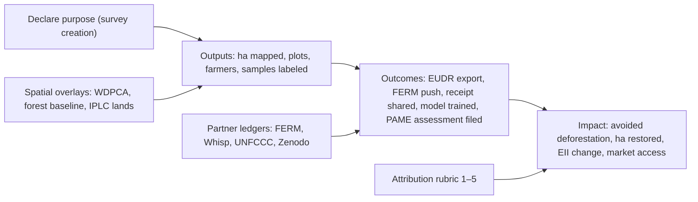

<!--
  Copyright 2026 The Ground Authors.

  Licensed under the Apache License, Version 2.0 (the "License");
  you may not use this file except in compliance with the License.
  You may obtain a copy of the License at

      https://www.apache.org/licenses/LICENSE-2.0

  Unless required by applicable law or agreed to in writing, software
  distributed under the License is distributed on an "AS IS" BASIS,
  WITHOUT WARRANTIES OR CONDITIONS OF ANY KIND, either express or implied.
  See the License for the specific language governing permissions and
  limitations under the License.
-->

# Impact Measurement

Authors: [Gino Miceli](https://github.com/gino-m) \
Last modified: 2026-10-09

## Summary

Ask about *purpose* once, when an organizer creates a survey, and give them something useful in return: a template, validation rules, an export profile, and a dashboard. Everything else can be worked out with **no extra questions in the field**. That means questions linked to a shared dictionary of standard fields, spatial overlays done on the server, "data was used" events (exports, FERM and Whisp pushes, receipts, DOIs), and checking our numbers against partner registries. Each survey then gets a 1–5 attribution score, so numbers move up a ladder: hectares mapped (output) → data used for a decision or report (outcome) → avoided loss, restored hectares, ecological integrity (impact).

This document expands on the **Built-In Impact Measurement (MAP Framework)** requirement in the [Product Requirements](prd.md#governance-sharing--map-impact-dashboards).

## Goals in Scope

*   **Climate change mitigation through reducing deforestation and degradation**: forest-risk commodity regulations (EUDR, UK FRC regime) and voluntary approaches (jurisdictional REDD+, TFFF).
*   **Ecosystem restoration**: reporting restoration activities to the UN Decade on Ecosystem Restoration through FERM.
*   **Sustainable supply chains**: timber supply chain monitoring.
*   **Indigenous Peoples and local communities (IPLC)**: sustainable land management, expanding economic opportunities, and producing data to gain access to global markets.
*   **Better, more timely land use / land cover maps (especially forest)**: collecting training and validation data for ML models.
*   **Protected and conserved area effectiveness**: GD-PAME.
*   **CBD Global Biodiversity Framework Target 2**: any FAO activity under Target 2, for which FAO is the custodian agency.

## Design Principles

*   **Purposes, not pillars, in the UI.** Organizers think "EUDR due diligence" or "FERM restoration report", not "Mitigation". Ground maps each purpose to a MAP pillar behind the scenes.
*   **Tagging must pay for itself.** Choosing a purpose unlocks something the organizer wants anyway: a starter form, compliance checks, a partner export, a funder report. If it feels like a tax, people will pick "Other".
*   **Field collectors never answer Ground's questions.** Field-side signals come only from questions the organizer wanted anyway (via templates) or from passive metadata.
*   **Count unique hectares, not cumulative ones.** Use GeoID to remove duplicates across monitoring waves, surveys, and organizations so the same plot is never counted twice.
*   **Aggregate before data leaves the organization.** Only cell-level areas and counts (S2 cells) feed platform-wide metrics. Raw geometries stay with the organization.

## The Measurement Ladder

## Zero-Burden Signals (Passive)

### Purpose Packs at Survey Creation

One multi-select step in the Survey Designer: **"What will this data be used for?"** Each choice is a *Purpose Pack*: starter forms with dictionary-linked questions, validation rules, an export profile, and a hidden MAP mapping. The global packs below are available to everyone; organizations can add their own (see [Organization Libraries](#organization-libraries)).

<!-- mdformat off -->

| Purpose Pack | What the organizer gets | Hidden pillar / goal |
| :--- | :--- | :--- |
| EUDR / UK FRC due diligence | Plot template (commodity, producer, harvest year), check that plots over 4 ha are polygons, 6-decimal coordinates, TRACES-ready GeoJSON, Whisp risk check | Mitigation (sustainable supply chains) |
| Timber traceability | Concession and harvest-unit layers, chain-of-custody forms, link from log or stump to plot | Mitigation (sustainable supply chains) |
| Jurisdictional REDD+ / TFFF | CEO sample design plus field verification forms, activity-data export | Mitigation (reported separately; see below) |
| Restoration monitoring (FERM) | Intervention-area template, multi-wave survival forms, FERM API push | Target 2 / Mitigation |
| Protected area management (PAME) | Patrol and threat forms, METT-4 / IMET-style assessment, export ready for GD-PAME | Protection |
| Community land and resource mapping | Boundary, tenure, and resource-use templates, FPIC consent block, data-sovereignty defaults | Adaptation / IPLC |
| Producer registration / market access | Farmer and plot registry, offline PDF receipts | Adaptation / IPLC |
| Land cover training and validation data | CEO interpretation plus field reference forms, Zenodo DOI export | Better LULC maps |

<!-- mdformat on -->

### Dictionary-Linked Questions

*   Template questions are linked to **concepts** in the dictionary (e.g., `eudr.commodity`, `ferm.area_under_restoration_ha`, `pame.threat_type`, `ferm.trees_surviving`). In forms, a link is a `ground:concept` bind attribute (XLSForm column `bind::ground:concept`); other XForms tools ignore it, so forms stay portable.
*   Organizers can change labels, languages, and logic freely. As long as the link stays, Ground can roll answers up across thousands of different surveys without asking anything new.
*   Organizers can also link their own questions: typing a question label shows non-intrusive suggestions from the dictionary, and selecting one links the question (and, for new questions, fills in the type and choices).
*   Concepts line up with external vocabularies so they mean something outside Ground: FERM indicators, EUDR Article 9 fields, METT-4 items, FAO LCCS / FRA classes, HS codes, and AGROVOC.

See [Concepts and the Dictionary](../technical/model/library/01-concepts.md) for the schema.

### Organization Libraries

Purpose Packs, form templates, and dictionary concepts live in **organization libraries**. The synthetic **"All users"** organization holds the **global library**, which applies to every survey; each organization can add its own entries on top. Managers of "All users" curate the global library.

*   **Resolution**: a survey sees its organization's entries plus the global ones; personal surveys see only global entries.
*   **Hiding**: organizations can hide global templates (and the Purpose Packs built on them) they don't use.
*   **Organization concepts** use an `org.<organization_id>.` prefix, so they can never redefine a global concept. They feed the organization's own dashboards. If an organization suggests a MAP goal for one of its concepts, the global dashboard reports it separately under **Organization-suggested indicators**, never added to the main goal totals. Widely used organization concepts can be promoted to the global library.

See the [library specification](../technical/model/library/00-introduction.md) for details.

### Server-Side Spatial Overlays (No User Input)

Intersect each map feature's footprint (with duplicates removed by GeoID) with authoritative layers in Earth Engine:

<!-- mdformat off -->

| Overlay | Metric it produces |
| :--- | :--- |
| WDPA / WDCA (protectedplanet.net) | ha monitored inside protected or conserved areas; protected areas with active Ground monitoring (protection tier 2) |
| JRC TMF / Hansen GFC / Forest Data Partnership commodity models / Natural Forests 2020 | Plots and ha in high-risk forest frontiers; share verified deforestation-free after the 2020 cutoff |
| LandMark / IPLC territories | ha of IPLC land mapped by IPLC-led organizations |
| Restoration opportunity / degraded land maps | ha of restoration in priority areas |
| UNEP-WCMC Ecosystem Integrity Index (EII) | EII trend inside Ground-monitored areas vs matched controls (protection tier 3) |
| FAO GAUL admin boundaries | Country and subnational breakdowns for every metric |

<!-- mdformat on -->

### "Data Was Used" Events

These are the strongest passive outcome signals. Log each one with purpose, area, and count (aggregate only):

*   **Exports by profile**: EUDR GeoJSON, FERM, Arena, Shapefile for a national registry.
*   **Partner pushes**: FERM API, Whisp risk assessment, webhooks to national registries.
*   **Receipts**: offline PDF receipts generated or shared, with counts of unique producers holding proof of their plot (a market-access proxy).
*   **Open data**: Zenodo DOIs minted, plus downloads and citations (the Ghana cocoa dataset has 2,000+ views and 280 downloads).
*   **Longitudinal waves**: repeat visits to the same map feature. Sustained monitoring is itself an outcome (restoration survival, patrol frequency).

### Productivity and Quality (MRV Cost Savings)

The [client audit logs](../technical/model/forms/17-client-audit-logs.md) and submission metadata already let Ground estimate the following without asking anyone:

*   Time per plot, plots per enumerator-day, and rework rate. Comparing against a paper or ODK baseline gives MRV cost and time savings.
*   Share of plots passing EUDR geometry checks, plus the GPS accuracy distribution. This shows the data is good enough to win market access.
*   Days from field collection to partner submission (timeliness).

## Light-Touch Questions (Organizer-Side, at Natural Moments)

<!-- mdformat off -->

| Moment | Question | Why it's cheap |
| :--- | :--- | :--- |
| Organization creation | Organization type (government agency, cooperative, IPLC organization, NGO, company, research) and country | Asked once per organization; needed for quotas and sponsorship anyway |
| Survey creation | Purpose Pack(s) plus optional program (EUDR, FRC, ART-TREES / jurisdictional REDD+, TFFF, FERM, GD-PAME, FSC / Rainforest Alliance, national forest inventory) | Drives the template; the user picks a template either way |
| Survey close / archive | **"What happened with this data?"** Submitted to EUDR DDS · reported to FERM · used for land titling · shared with buyers · trained or validated a model · used for protected area management · not yet | One tap per survey lifecycle; the single most valuable outcome signal |
| Survey close (optional) | "Compared with your previous method, this took… less / same / more time and cost" | Feeds the MRV savings estimate |
| Monthly sponsor digest | "Confirm these numbers for your funder report" | The organization is checking the numbers for its own donors anyway |

<!-- mdformat on -->

## Measurement Outside the App (Partner Ledgers)

*   **FERM**: restoration initiatives and hectares registered with `source = Ground`. FAO is the custodian of GBF Target 2, so this is the cleanest attribution path for Target 2.
*   **Whisp**: plots analyzed that originated in Ground.
*   **UNFCCC REDD+ / FRA**: countries citing CEO or Ground in FREL/FRL, BTR, or FRA Remote Sensing Survey submissions (desk review, done each year).
*   **GD-PAME**: PAME assessments filed through the Ground PAME pack, and the protected area they cover.
*   **ML pipelines**: reference samples used in Forest Data Partnership commodity models or national LULC maps, plus the accuracy gain from adding Ground samples.
*   **Funding**: letters of agreement and grants that name Ground (e.g., the $100,000 DRSRS Kenya LoA). Count the funding and the hectares those agreements fund.
*   **Capacity**: training → activation funnel. Share of trainees whose organization creates its own survey within 90 days (in Nandi County, Kenya, 4 trained coordinators led cooperatives to map 2,000+ additional plots independently, about 60% coverage).

## From Outcomes to MAP Impact

<!-- mdformat off -->

| Goal | Output (passive) | Outcome signal | Impact metric | Notes |
| :--- | :--- | :--- | :--- | :--- |
| Deforestation (EUDR / FRC) | Unique ha and plots registered by commodity | EUDR export, Whisp check, close-out "submitted to DDS" | ha of deforestation-free supply verified; producers keeping EU market access | Sustainable supply chains count under Mitigation |
| Jurisdictional REDD+ / TFFF | CEO samples labeled, field verifications | Activity data used in FREL/FRL or TFFF reporting | Contribution to jurisdictional emissions accounting | Reported separately from supply-chain and restoration totals because of open questions about timber leakage |
| Restoration (FERM, Target 2) | ha under restoration, trees planted | FERM push or registration | ha restored × multi-wave survival → tCO₂e removals (IPCC Tier 1 factors, checked remotely with Earth Engine canopy and biomass maps) | Most defensible attribution path |
| Timber supply chains | Harvest units and logs traced | Chain-of-custody exports | Volume or ha under traceable, legal harvest | |
| IPLC | IPLC-led organizations, ha of community land mapped, producers with receipts | Receipts shared, land titling, market listings | Producers with market access; income or price premium (sampled case studies) | Respect CARE and data-sovereignty defaults |
| LULC maps | Reference samples (desk and field) | DOI minted, model trained | Accuracy gain in Forest Data Partnership or national maps | |
| GD-PAME / Protection | ha of protected area with recurring patrols or monitoring | PAME assessment filed | Tier 1: WDPCA ha designated · Tier 2: active management via Ground · Tier 3: EII vs counterfactual | Follows a three-tier protection rubric (designation → management → ecological outcome) |

<!-- mdformat on -->

### Attribution Rubric

Give each survey a 1–5 score automatically, using its purpose, outcome signals, and close-out answer:

<!-- mdformat off -->

| Score | Meaning |
| :--- | :--- |
| 1 | Ground used for an exploratory or test survey |
| 2 | Ground used to collect data, outcome unknown |
| 3 | Data exported for a declared purpose |
| 4 | Data pushed to or confirmed in a partner system (FERM, Whisp, registry) |
| 5 | Ground is the system of record for a regulatory or official submission (DDS, FERM, FREL, PAME) |

<!-- mdformat on -->

## Guardrails

*   **Open-source telemetry**: aggregate impact metrics must be documented, disclosed in the privacy policy, approved through Open Foris governance, and possible to turn off. Self-hosted instances report nothing unless they opt in.
*   **Sensitive locations**: blur or suppress patrol routes, protected area threat reports, and IPLC sacred sites in any public dashboard (poaching and land-grab risk). Apply k-anonymity thresholds to S2 cells.
*   **Shared credit**: agree on counting rules with FAO and SIG up front, so Google's sustainability goals, FAO reporting, and funder digests use the same deduplicated numbers and nobody double-claims.

## Recommended Short List for Ground 2.0

1.  **Purpose Packs** at survey creation, mapped to pillars behind the scenes. This replaces "organizers tag MAP pillars".
2.  **Organization libraries and the dictionary**: global and organization-level concepts, templates, and packs; dictionary-linked questions with label autocomplete; GeoID-deduplicated aggregation.
3.  **Server-side overlays** (WDPCA, forest baseline, IPLC lands, admin boundaries) computed in Earth Engine.
4.  **Outcome event logging** plus the one-tap **close-out question**.
5.  **Quarterly partner-ledger check** (FERM, Whisp, UNFCCC / FRA, Zenodo) and the 1–5 attribution score.

## Future Research

*   **Embedding-assisted linking**: semantic and cross-language suggestions when linking questions to the dictionary, and suggested links for questions nobody linked (Ground 1.0 data, imported forms). Official totals would still count only explicit or confirmed links.
*   **Clustering for dictionary growth**: grouping unlinked questions across surveys to find candidate global concepts, complementing the promotion of organization concepts.

## Open Questions

*   **Primary audience**: Google's sustainability goals, FAO / Open Foris reporting, or funders? Attribution rules and how conservative the numbers are depend on the answer.
*   **Telemetry posture**: is the Open Foris steering committee comfortable with aggregate impact telemetry being on by default, or should it be opt-in?
*   **Pillar visibility**: should pillar labels appear anywhere in the open-source UI, or only in partner-side reporting?
*   **Counterfactuals**: which goal deserves a rigorous evaluation (e.g., EII or matched-control deforestation for Ground-monitored protected areas) as a flagship evidence case?
