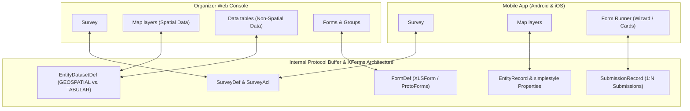

<!--
  Copyright 2026 The Ground Authors.

  Licensed under the Apache License, Version 2.0 (the "License");
  you may not use this file except in compliance with the License.
  You may obtain a copy of the License at

      https://www.apache.org/licenses/LICENSE-2.0

  Unless required by applicable law or agreed to in writing, software
  distributed under the License is distributed on an "AS IS" BASIS,
  WITHOUT WARRANTIES OR CONDITIONS OF ANY KIND, either express or implied.
  See the License for the specific language governing permissions and
  limitations under the License.
-->

# Ground 2.0 Terminology & Cross-Platform Parity

Authors: [Gino Miceli](https://github.com/gino-m) \
Last modified: 2026-09-25

## Overview & Mental Model

Ground 2.0 unifies offline-first field data collection with desk-based satellite visual classification (formerly Collect Earth Online) on top of the industry-standard **XForms / XLSForm** architecture. To make the platform intuitive across diverse user groups—conservation coordinators, agricultural extension agents, remote sensing analysts, and software developers—Ground 2.0 establishes a clean separation between **User-Facing Terminology** and **Internal Engine Primitives**:

### Core User-Facing Principles

1. **"Map layers" and "Data tables" Replace Bespoke Entities & Sites**:
   * **Map layers** represent spatial datasets rendered directly on the map (e.g., preloaded sample plots, boundary polygons, or deforestation alert layers). In the Organizer Console, clicking a Map layer displays the map viewport, layer styling controls (marker symbols, stroke width, fill opacity), and feature attribute tables. On the Mobile App, users view, filter, and toggle **Map layers** in the map drawer and tap items on the map. We use **Map layers** consistently in both the web console and mobile UI without introducing extraneous terms.
   * **Data tables** (or Lookup Data tables) represent non-spatial tabular datasets (e.g., farmer rosters, cooperative membership directories, species taxonomies). In the Organizer Console, clicking a Data table opens a clean spreadsheet view without map controls.
   * **"Data Collection Site" is completely retired**: Real-world geographical objects may be boundaries, rivers, assets, or sample plots—not all of which are "collection sites".
2. **Relational Tables for Plots and Sub-Plots**:
   * In statistical remote sensing (Collect Earth Online workflows), a campaign often evaluates **Plots** (e.g., $100\text{m} \times 100\text{m}$ squares) containing a grid of **Sub-Plot Sample Points** (e.g., 25 internal points).
   * Rather than introducing specialized "SubPlot" primitives into the core data model, Ground 2.0 expresses this natively through **Relational Tables**: a child spatial table (`samples`) has a foreign key property (`plot_id`) referencing the parent spatial table (`plots`).
3. **User-Defined Workflow Progression via `save_to`**:
   * Ground 2.0 does **not** hardcode a fixed enum of entity lifecycle states.
   * Instead, surveys track progress dynamically by storing `simplestyle-spec` properties (`marker-symbol`, `marker-color`, `stroke`, `fill`) and custom status properties (e.g., `status = "Needs Field Validation"`) on the entity, updated via XForms `save_to` bindings upon form submission.
   * Typical field defaults: `○` (Pending) $\rightarrow$ `◐` (In Progress) $\rightarrow$ `✓` (Completed).
   * Typical desk-to-field defaults: `○` (Unanalyzed) $\rightarrow$ `✓` (Consensus Reached) $\rightarrow$ `!` (Flagged for Field Validation) $\rightarrow$ `?` (Disputed / Needs SME Review).

---

## Cross-Platform Terminology Parity Matrix

The following matrix maps Ground 2.0 terminology against industry-standard data collection tools, Open Foris Arena, and Collect Earth Online (CEO):

| Concept | Ground 2.0 (User-Facing) | Collect Earth Online (CEO) | ODK Central / Collect | KoboToolbox | XLSForm Sheet / Syntax | ArcGIS Survey123 | Open Foris Arena | Ground 1.0 (Legacy) | Internal Proto Schema |
| :--- | :--- | :--- | :--- | :--- | :--- | :--- | :--- | :--- | :--- |
| **Top-Level Project Container** | **Survey** | **Project** | **Project** | **Project** | *(Workbook)* | **Survey** | **Survey** | **Survey** | `groundplatform.v2.survey.SurveyDef` |
| **Organizational Tenant** | **Organization** | **Institution** | *(Server Instance)* | *(Account / Team)* | *(N/A)* | **Organization (AGOL)** | *(N/A)* | *(N/A)* | `SurveyDef.organization_id` |
| **Questionnaire** | **Form** | **Survey** / **Survey Questions** | **Form** | **Form** | `survey` sheet | **Form** | **Survey Definition** | **Job** | `groundplatform.v2.forms.FormDef` |
| **Question Section / Card** | **Group** *(rendered as **Card** in web/desktop)* | **Survey Card** | **Group** (`field-list`) | **Group** | `begin group` / `end group` | **Group** / **Page** | **Form Section** | *(N/A)* | `groundplatform.v2.forms.GroupDef` |
| **Individual Entry** | **Question** | **Question** | **Question** | **Question** | Row in `survey` sheet | **Question** | **Node Definition (Attribute)** | **Task** | `groundplatform.v2.forms.FieldBinding` & control |
| **Fixed Guidance / Note** | **Note** *(form-level) / **Survey Guide** (survey-level)* | **Interpretation Key** / **Learning Material** | **Note** | **Note** | `note` question type | **Note** | **Description / Instructions** | **Instructions** | `groundplatform.v2.forms.NoteDef` & `SurveyDef` docs |
| **Data Record** | **Submission** | **Plot Interpretation** / **Sample Labels** | **Submission** | **Submission** / **Record** | Submission XML / Instance | **Response** / **Feature** | **Record** | **Submission** | `groundplatform.v2.data.SubmissionRecord` |
| **Spatial Master Dataset** | **Map layer** | **Plots** (with Sub-Plot Samples) | **Entity List** (Spatial) | **Dynamic Data Attachment** (Spatial) | `entities` sheet + CSV / GeoJSON | **Hosted Feature Layer** | **Sampling Design** (Spatial) | **Data collection site** (LOI) | `EntityDatasetDef (type = GEOSPATIAL)` |
| **Non-Spatial Master Dataset** | **Data table** | *(N/A)* | **Entity List** (Tabular) | **Dynamic Data Attachment** (CSV) | `entities` sheet / `select_one_from_file` | **Table** | **Code List** / **Taxonomy** | *(N/A)* | `EntityDatasetDef (type = TABULAR)` |
| **Individual Spatial Item** | **Item in a Map layer** *(or Plot / Polygon)* | **Sample Plot** | **Entity** | **Record / Item** | Row in external CSV | **Feature** | **Sampling Point / Plot** | **Site** / **LOI** | `groundplatform.v2.data.EntityRecord` |
| **Within-Plot Sampling Unit** | **Sub-Plot Sample** *(Sample Point / Drawn Feature)* | **Sample** (**Sample Point** or **User-Drawn Sample**) | **Repeat Item** or child **Entity** | **Repeat Item** | `begin repeat` or child entity reference | **Repeat** | **Sub-plot Node** | *(N/A)* | Child `EntityRecord` referencing `plot_id` or `RepeatDef` |
| **Conditional Follow-up** | **Conditional Question (Skip Logic)** | **Parent / Child Question** | **Skip Logic** (`relevant`) | **Skip Logic** | `relevant` expression | **Skip Logic** | **Applicable Condition** | *(N/A)* | `FieldBinding.relevant_expression` |
| **Data Quality Rules** | **Validation Rules** | **Survey Rules** *(Sum, Matching Sums, Incompatible, Range, Regex)* | **Constraints** (`constraint`) | **Validation Criteria** | `constraint` + `constraint_message` | **Constraint** | **Validation Rule** | *(N/A)* | `FieldBinding.constraint_expression` |
| **Choice Map Color** | **Option Color** | **Answer Color Swatch** | *(Styled via external SVG/CSS)* | *(N/A)* | `color` property | *(N/A)* | *(N/A)* | *(N/A)* | `ItemDef.color` or `simplestyle` attribute |
| **Survey Geography** | **Survey Area** *(place name & bounds; AOI in sample designer)* | **Area of Interest (AOI)** | *(N/A)* | *(N/A)* | *(N/A)* | **Study Area** | **Boundary (AOI)** | *(N/A)* | `SurveyDef.survey_area` & `SampleDesignConfig.aoi` |
| **Historical Image Analysis** | **Time Series & Imagery** | **Geo-Dash** | *(N/A)* | *(N/A)* | *(N/A)* | *(N/A)* | **Collect Earth / TimeSync** | *(N/A)* | `MapConfig.imagery_analytics` |
| **Multi-Analyst Quality Control** | **Consensus & Disagreement Review** | **Convergence of Evidence** (Peer Consensus & SoT) | *(External analysis)* | *(N/A)* | *(N/A)* | *(N/A)* | **Data Quality Assessment** | *(N/A)* | Multi-`SubmissionRecord` consensus evaluation |
| **Concurrent Disconnected Edits** | **Offline Sync Conflict Queue** | *(N/A — Web only)* | **Server Conflict Resolution** | *(N/A)* | *(N/A)* | *(N/A)* | *(N/A)* | *(N/A)* | Operational write-collision queue |

---

## Detailed Clarifications of Common Misalignments

### 1. "Survey" vs. "Project" vs. "Form"
* **The Confusion**: In Collect Earth Online (CEO) and KoboToolbox, the root container is called a **Project**, and the questionnaire inside is called a **Survey**. In Ground 2.0 (and Open Foris Arena / ArcGIS Survey123), the root container is a **Survey**, and the questionnaire inside is a **Form** (`FormDef`).
* **Resolution**: Ground 2.0 maintains **Survey** as the container and **Form** as the questionnaire. Migration tools and UI onboarding from CEO will explicitly label this: *"Import CEO Project as a Ground Survey"*, where CEO's "Survey Questions" become a Form within the survey.

### 2. "Map layers" and "Data tables"
* **The Confusion**: Ground 1.0 used "Data collection sites", and early 2.0 drafts used "Tables" or "Entities" interchangeably for both non-spatial rosters and map polygons.
* **Resolution**:
  * We use **"Map layers"** consistently across both the Organizer Survey Designer and the Mobile UI. In the designer, **Map layers** configure map display and symbology, while **Data tables** manage non-spatial lookup registries.
  * In the mobile app's expandable search list, content is organized into three clean sections:
    1. **Map layers**: Spatial datasets grouped by layer, with entity records elevated to direct list items (eliminating nested card-in-card hierarchy).
    2. **Data tables**: Tabular master datasets and registries.
    3. **Places**: Regional geographic places and landmarks.
  * Headings omit trailing type chips or badges (e.g. no trailing "Layer", "Table", or "Mapbox" labels), and category filter chips are omitted from the search bar to keep multi-layer search direct and uncluttered. Sections without entries (such as "Data tables" when none are configured or no matches exist) are omitted from the list view rather than rendering empty placeholders. On mobile, data collectors toggle map layer visibility in the map drawer and search across all datasets seamlessly.

### 3. Survey Area
* Ground surveys use **"Survey Area"** everywhere to describe the geographic scope (place name and bounding coordinates, e.g. "Nandi County, Kenya"), ensuring collectors are not artificially boxed into hard polygon perimeters. The term **Area of Interest (AOI)** is reserved strictly for the mathematical polygon bounding the probabilistic sample design generator.

### 4. Time Series & Imagery
* Instead of proprietary branding like "Geo-Dash", the historical satellite and spectral index analysis panel is simply called **"Time Series & Imagery"**.

### 5. Sub-Plot Samples: Relational Tables vs. New Primitives
* **The Confusion**: CEO uses a two-tier spatial hierarchy (Plot $\rightarrow$ Sample points) where fractional land cover (e.g. 70% Forest, 30% Agriculture) is calculated from sample points.
* **Resolution**: Ground 2.0 avoids adding specialized "SubPlot" primitives to Protocol Buffers. Instead, the Sample Designer generates two standard linked tables: a parent `plots` layer and a child `samples` layer (with each sample point having a `plot_id` property). On the mobile form runner, sub-plots are simply handled as an XForms `begin repeat` loop over the points.

### 6. Multi-Interpreter Disagreement vs. Offline Sync Conflict
* **The Confusion**: Early concept briefs suggested reusing the "Conflict Review Queue" for photo-interpretation disagreement.
* **Resolution**:
  * **Offline Sync Conflicts**: Accidental concurrent writes when two offline field devices edit the same entity's attributes. Resolved operationally by picking an authoritative edit.
  * **Consensus & Disagreement Review**: An intentional statistical workflow where multiple analysts independently evaluate the same plot. The 1:N relationship between an entity and submissions naturally stores every analyst's submission independently. The backend calculates agreement metrics (Peer Consensus and Source-of-Truth comparison) and routes disputed plots to a supervisor adjudication queue.

### 7. Survey Lifecycle States
To align with both CEO and enterprise field governance, Ground 2.0 adopts a 5-stage lifecycle:
1. **`DRAFT`**: Authoring, logic testing in live preview, not visible for field synchronization.
2. **`PUBLISHED`**: Active and live for data collection (mobile sync and web interpretation).
3. **`CLOSED`**: Data collection concluded; read-only; visible on active lists and reporting dashboards, but rejecting new submissions.
4. **`ARCHIVED`**: Hidden from default active lists; permanently preserved for long-term historical records and auditability.
5. **`DELETED`**: Soft-deleted; stored in 30-day recovery trash before purge.
