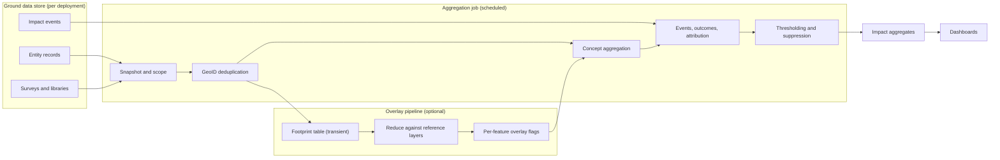

<!--
  Copyright 2026 The Ground Authors.

  Licensed under the Apache License, Version 2.0 (the "License");
  you may not use this file except in compliance with the License.
  You may obtain a copy of the License at

      https://www.apache.org/licenses/LICENSE-2.0

  Unless required by applicable law or agreed to in writing, software
  distributed under the License is distributed on an "AS IS" BASIS,
  WITHOUT WARRANTIES OR CONDITIONS OF ANY KIND, either express or implied.
  See the License for the specific language governing permissions and
  limitations under the License.
-->

# Impact Aggregation and Spatial Overlays

Authors: [Gino Miceli](https://github.com/gino-m) \
Status: Draft for review \
Last modified: 2026-10-10

## Summary

This document designs the backend that turns Ground's field data into impact
figures: a scheduled **aggregation job** that rolls up dictionary-linked answers,
impact events, and survey outcomes into privacy-safe aggregates, and an optional
**spatial overlay pipeline** that intersects deduplicated map features with
authoritative reference layers (protected areas, forest baselines, Indigenous
and community lands, administrative boundaries, ecosystem integrity) using
Google Earth Engine. Aggregates power the organization, survey, and global
impact dashboards described in [Impact Measurement](../../product/impact-measurement.md).

The design keeps raw geometries and answers inside each organization's scope,
publishes only thresholded aggregates beyond it, and leaves hosting, data
processing terms, and reference-layer licensing as explicit decisions.

## Goals and Non-Goals

### Goals

*   Compute per-concept aggregates at survey, organization, country, global,
    and grid-cell scope, honoring each concept's `aggregation`, `privacy_class`,
    and owning library.
*   Count each real-world plot once, using GeoID deduplication across
    monitoring waves, surveys, and organizations.
*   Roll up impact events (`ImpactEvent`) and survey outcomes (`SurveyOutcome`)
    and compute the 1–5 attribution score per survey.
*   Produce overlay statistics (e.g., hectares inside protected areas) without
    publishing any feature geometry.
*   Share aggregation logic with the prototype so dashboards behave the same in
    demos and production.

### Non-Goals

*   Real-time dashboards. Daily freshness is sufficient.
*   Carbon accounting or tCO₂e estimation. Those are separate, methodology-
    specific analyses that may consume these aggregates later.
*   Public raw-data APIs. Only aggregates leave an organization's scope.
*   Sponsor digests (deferred).

## Inputs

<!-- mdformat off -->

| Input | Source | Used for |
| :--- | :--- | :--- |
| Map features (current state) | `EntityRecord` (`groundplatform.v2.data`) | Geometry, GeoID, property values |
| Concept links | `SurveyDef.form_concept_links`, `EntityPropertyDefinition.concept_ref` | Which properties carry which concepts |
| Concept definitions | Organization libraries (`ConceptDef`) | Aggregation rule, privacy class, goals, code lists |
| Survey context | `SurveyDef` (`organization_id`, `purpose_ids`, `program_ids`, `outcome`, state) | Scope, purposes, outcomes |
| Organization context | `Organization` (`organization_type`, `country_code`, aggregation opt-out) | Breakdowns and exclusions |
| Impact events | `ImpactEvent` | Outcome signals (exports, receipts, closes) |
| Reference layers | Earth Engine assets (see [Reference Layers](#reference-layers-and-licensing)) | Overlay statistics |

<!-- mdformat on -->

A new boolean, `Organization.exclude_from_platform_aggregates` (field 12),
records the organization-level opt-out described in the product doc. An
opted-out organization's surveys are kept out of global, country, and grid cell
aggregates and organization-suggested indicators; its own survey and
organization dashboards are unaffected. Personal surveys (no organization)
always count toward platform-wide aggregates.

## Architecture



The job runs once per day per deployment, plus on-demand recomputation for a
single survey (for example, when an organizer opens a dashboard after closing a
survey). Each run is identified by a `run_id` and a `pipeline_version`; outputs
are written atomically per scope so dashboards never read a partial run.

## Aggregation Job

### Snapshot and Scope

1.  For each survey that is not deleted, read its current map features and its
    resolved concept links (survey-level links are authoritative).
2.  Resolve each linked concept against the survey's resolved library (global
    plus the owning organization's entries). Links to unknown or deprecated
    concepts, and to concepts owned by another organization (or by any
    organization, for personal surveys), are skipped and recorded once per
    survey and concept in run diagnostics (`UNKNOWN`, `DEPRECATED`,
    `NOT_IN_LIBRARY`). Values a feature carries for concepts its survey doesn't
    link are ignored.
3.  Classify each concept: **global** (owned by `org-all-users`) or
    **organization**; note suggested goals on organization concepts.

### GeoID Deduplication

*   Each feature's GeoID is the deterministic AgStack-style identifier already
    computed by clients (`AgStackGeoId`). Features without a GeoID (e.g.,
    tabular rows) are counted individually.
*   Within a scope, features sharing a GeoID (compared after trimming) count
    once. The **winning record** is the most recently updated feature; its
    geometry provides area and its properties provide values. Ties break by
    the smallest entity ID, then the smallest survey ID, so the winner never
    depends on input order.
*   Only the winner's values count: values are never merged across
    duplicates. If the winner's survey doesn't link a concept (or the winner
    has no value for it), the plot has no value for that concept in that
    scope, even when a losing duplicate has one.
*   Deduplication is applied per scope: a plot mapped by two organizations
    counts once in global totals and once in each organization's own
    dashboard. Country and grid cell scopes group the global winners, so each
    plot counts in exactly one country and one cell.
*   Area is the geodesic area of the winning geometry (WGS84; a polygon's
    exterior ring minus its holes; points and lines have none). When the
    geometry is missing or has no area, the feature's precomputed area is
    used. If the survey links `core.area_ha`, the linked value is reported
    alongside the computed area for comparison.

### Concept Aggregation

Each concept's `aggregation` rule determines the computation:

<!-- mdformat off -->

| Rule | Computation | Output |
| :--- | :--- | :--- |
| `COUNT_DISTINCT_FEATURES` | Deduplicated features with a non-empty value | `feature_count`, `area_ha` |
| `COUNT_BY_CODE` | Deduplicated features per code-list value (`ground_code`); a select-multiple value counts once for each of its space-separated codes | One row per code (`feature_count`, `area_ha`), ordered by code |
| `SHARE_BY_CODE` | As above, divided by features with any value | One row per code; `value` is the share (0–1) |
| `SUM` | Sum of numeric values over deduplicated features | `value`; `feature_count` and `area_ha` of contributing features |
| `MEAN` | Mean of numeric values over deduplicated features | `value` (0 without values), `feature_count` |
| `NONE` | Not aggregated (names, identifiers) | — |

<!-- mdformat on -->

Values are normalized to the concept's unit (UCUM) before aggregation; values
that cannot be normalized are skipped and counted in diagnostics
(`NOT_A_NUMBER` for text that isn't a decimal number, `UNSUPPORTED_UNIT` for
a unit that isn't supported or can't be converted). A value without a unit is
already in the concept's unit. Supported conversions use case-sensitive UCUM
codes: area `m2`, `har`, `km2`; mass `g`, `kg`, `t`; length `cm`, `m`, `km`;
volume `L` (or `l`), `m3`. Any code converts to itself.

Besides concept rows, every scope has a `FEATURES` row (all deduplicated
features and their area), and one `DISTINCT_VALUES` row counts the distinct
values (trimmed, case-insensitive) of the first configured identifying concept
the scope links, such as `core.producer_id` or `core.producer_name`, as
"producers registered", regardless of its aggregation rule. Privacy rules apply
to it like any other concept.

### Scope Rules

<!-- mdformat off -->

| Concept | Survey and organization scope | Global and country scope |
| :--- | :--- | :--- |
| Global | Included | Main goal totals |
| Organization, no suggested goal | Included | Excluded |
| Organization, suggested goal | Included | Global scope only: **organization-suggested indicators**, one set of rows per suggested goal and organization, computed over that organization's own deduplicated features; never added to main totals |
| Any `SENSITIVE` concept | Included (organization only) | Excluded |
| Any concept from an opted-out organization | Included | Excluded |

<!-- mdformat on -->

Each scope reads a defined set of surveys:

<!-- mdformat off -->

| Scope | `scope_id` | Surveys and features | Concepts |
| :--- | :--- | :--- | :--- |
| `SURVEY` | Survey ID | The survey's features | Every resolved link, including `SENSITIVE` and organization concepts |
| `ORGANIZATION` | Organization ID | All the organization's surveys, deduplicated together (personal surveys have no organization scope) | Union of the surveys' resolved links |
| `GLOBAL` | Empty | Surveys of organizations that didn't opt out, plus personal surveys, deduplicated together | Global, non-`SENSITIVE` links (`AGGREGATE_PUBLIC` and `ORG_ONLY`), plus organization-suggested rows |
| `COUNTRY` | ISO 3166-1 alpha-2 code | Global winners grouped by the feature's country, else its organization's; features with neither are left out | Global, non-`SENSITIVE` links of the surveys contributing winners; no organization-suggested rows |
| `CELL` | S2 token | Global winners with a geometry | None (`FEATURES` rows only) |

<!-- mdformat on -->

### Events, Outcomes, and Attribution

*   Impact events are counted per type at survey, organization, and global
    scope (`value` is the event count), with feature coverage and area summed
    from the events (already GeoID-deduplicated at recording time, so not
    deduplicated again). Types without events have no row.
*   Survey outcomes are counted per outcome kind at the same scopes (`value` is
    the number of surveys). A closed survey with no answer counts as
    `UNANSWERED`; an empty answer or one with only `NOT_YET` counts as
    `NOT_YET`; otherwise each answered kind counts once (`NOT_YET` mixed with
    other kinds is ignored). Open surveys count an answer only if they already
    have one.
*   The **attribution score** (1–5) is a deterministic function of the survey's
    purposes, events, outcome, and data:

<!-- mdformat off -->

| Score | Basis | Condition (first that applies) |
| :--- | :--- | :--- |
| 5 | `OFFICIAL_SUBMISSION` | Outcome includes `SUBMITTED_EUDR_DDS`, `REPORTED_FERM`, or `PROTECTED_AREA_MANAGEMENT` |
| 4 | `PARTNER_USE` | A `PARTNER_PUSH` event, or outcome includes `SHARED_WITH_BUYERS`, `LAND_TITLING`, or `TRAINED_OR_VALIDATED_MODEL` |
| 3 | `PURPOSE_EXPORT` | An `EXPORT` event whose export profile one of the survey's purposes enables |
| 1 | `EXPLORATORY` | No purposes and fewer than a minimum number of features (default 5) |
| 2 | `DATA_COLLECTED` | At least one feature or submission |
| 1 | `EXPLORATORY` | Otherwise (no data yet) |

<!-- mdformat on -->

`ATTRIBUTION` rows report one row per survey at survey scope and the
distribution of scores (surveys per score) at organization and global scope.
Only surveys with at least one global purpose, from organizations that didn't
opt out, count toward the platform-wide distribution.

### Grid Cells and Thresholding

*   Cell aggregates use S2 cells (reusing the shared S2 implementation in
    `shared/core`). Proposed levels: **level 10** (cells of roughly 80 km²) for
    organization dashboards and **level 7** (roughly 5,000 km²) for public
    views.
*   Each global winner with a geometry falls in the cell containing its
    representative point: a point's position, the mean of a line's vertices, or
    the mean of a polygon's exterior ring vertices (without the closing
    vertex).
*   A fine (level 10) cell is published beyond the organization only if it
    covers at least **k = 10 features from at least 2 organizations**, counting
    each winner's organization (personal surveys share one organization key).
    Features of unpublished fine cells merge into their level-7 ancestor, which
    is published under the same thresholds or else emitted as one suppressed
    row. Published cell feature counts plus suppressed cell features always
    equal the features with a geometry.
*   Country aggregates require at least 10 features. A country below the
    threshold has only a suppressed `FEATURES` row.
*   Suppressed rows have `suppressed` set and zeroed counts; dashboards show
    them as "fewer than 10" rather than omitting them, so totals remain honest.
    Run diagnostics record the number of suppressed cells, their features, and
    the number of suppressed countries.

### Output Schema

Rows are `ImpactAggregate` messages (`shared/protos/data/impact_aggregate.proto`):

```protobuf
message ImpactAggregate {
  enum ScopeType {
    SCOPE_TYPE_UNSPECIFIED = 0;
    SURVEY = 1;
    ORGANIZATION = 2;
    COUNTRY = 3;
    GLOBAL = 4;
    CELL = 5;
  }

  enum Metric {
    METRIC_UNSPECIFIED = 0;
    FEATURES = 1;         // all deduplicated features of the scope
    CONCEPT = 2;          // a linked concept, per its aggregation rule
    DISTINCT_VALUES = 3;  // distinct values of an identifying concept
    EVENT = 4;            // impact events of one type
    OUTCOME = 5;          // surveys per outcome kind
    ATTRIBUTION = 6;      // surveys per attribution score
  }

  string run_id = 1;
  int32 pipeline_version = 2;
  google.protobuf.Timestamp computed_at = 3;

  ScopeType scope_type = 4;
  string scope_id = 5;        // survey ID, organization ID, ISO code, S2 token, or empty
  string concept_id = 6;      // CONCEPT and DISTINCT_VALUES rows
  string code = 7;            // code-list value for *_BY_CODE rules
  ImpactEventType event_type = 8;
  string outcome_kind = 9;    // SurveyOutcome.Outcome name or UNANSWERED

  int64 feature_count = 10;
  double area_ha = 11;
  double value = 12;          // sum, mean, share, distinct values, events, or surveys
  bool suppressed = 13;
  bool organization_suggested = 14;
  int32 attribution_score = 15;
  string organization_id = 16; // concept owner for organization-suggested rows
  string goal = 17;            // suggested goal for organization-suggested rows
  Metric metric = 18;
}
```

Rows are ordered by scope (surveys by ID, organizations by ID, countries by
code, global, cells by token), then by metric: `FEATURES`, concept rows (by
concept ID and code), organization-suggested rows, `DISTINCT_VALUES`, events
(by type), outcomes, and attribution scores (ascending).

## Spatial Overlay Pipeline

### Flow

1.  **Footprint table**: after deduplication, the job writes a transient table
    of winning geometries keyed by an opaque hash of the GeoID, with **no
    attributes**, to a private Earth Engine asset (or Cloud Storage table) in
    the processing project.
2.  **Incremental processing**: only footprints whose geometry hash changed
    since the previous run are reprocessed; previous per-feature results are
    reused.
3.  **Reduction**: for each reference layer, `reduceRegions` computes
    per-footprint statistics (overlap area, overlap fraction, or the mean of a
    continuous layer such as EII), in batches sized to stay within Earth
    Engine quotas.
4.  **Per-feature flags**: results return to the job keyed by the opaque hash
    and are joined back to features in memory.
5.  **Cleanup**: the transient footprint asset is deleted at the end of the
    run. No footprint is retained outside the Ground data store.

### Overlay Metrics

<!-- mdformat off -->

| Layer | Metric per feature | Aggregate |
| :--- | :--- | :--- |
| Protected and conserved areas (WDPA / WDOECM) | Overlap area | ha of monitored features inside protected or conserved areas; count of areas with active Ground monitoring |
| Natural forest baseline (2020) | Overlap fraction | Plots overlapping natural forest at the EUDR cutoff |
| Tropical moist forest change (JRC TMF) / tree cover loss | Post-2020 disturbance area | Plots with post-cutoff disturbance; share verified deforestation-free |
| Indigenous and community lands | Overlap area | ha of IPLC land mapped (only when the mapping organization is an IPLC organization or has consent) |
| Administrative boundaries | Containing unit | Country and subnational breakdowns |
| Ecosystem Integrity Index | Mean value, yearly | Trend inside monitored areas vs matched controls |

<!-- mdformat on -->

### Reference Layers and Licensing

Every layer's license must be confirmed before production use. Derived
statistics are aggregates, but some licenses restrict commercial use or
redistribution of derived products.

<!-- mdformat off -->

| Layer | License status | Constraint to confirm |
| :--- | :--- | :--- |
| WDPA / WDOECM | Non-commercial terms | Whether published aggregates count as derived products; attribution wording |
| Natural forest baseline (2020) | To verify | Attribution and permitted uses |
| JRC TMF | To verify | Attribution |
| Global tree cover loss | CC BY 4.0 (to confirm version) | Attribution |
| Indigenous and community lands | Varies by contributing dataset | Some datasets restrict use; community consent requirements |
| Administrative boundaries | Varies by dataset and version | Choose a dataset whose license permits publishing breakdowns |
| Ecosystem Integrity Index | To verify | Availability in Earth Engine and permitted uses |

<!-- mdformat on -->

## Privacy and Security

*   **Aggregate-only egress**: nothing beyond thresholded aggregates leaves an
    organization's scope. Footprints sent to the overlay pipeline carry no
    attributes and are deleted after each run.
*   **Sensitive data**: `SENSITIVE` concepts never appear outside the owning
    organization. Patrol routes and threat reports are excluded from public
    cells regardless of thresholds.
*   **IPLC data**: IPLC land overlays follow CARE principles; results are shown
    only to the mapping organization unless it opts in to wider reporting.
*   **Opt-out**: honored at every run; opting out
    (`exclude_from_platform_aggregates`) removes the organization from all
    subsequent platform-wide aggregates: global, country, and grid cell rows,
    and organization-suggested indicators.
*   **Auditability**: each run records inputs counts, skipped links, suppressed
    cells, and pipeline version, so any published number can be traced.
*   **Access**: aggregates inherit the read permissions of their scope
    (survey ACL, organization membership, or public).

## Hosting Options

<!-- mdformat off -->

| Option | Description | Pros | Cons |
| :--- | :--- | :--- | :--- |
| **Per-deployment (default)** | Aggregation runs inside each Ground deployment; overlays use the deployment's own Earth Engine project | Data never leaves the deployment; works for self-hosters | Each deployment needs Earth Engine access and configuration; no cross-deployment totals |
| **Steward-hosted reference deployment** | The reference deployment's processing project is owned under Open Foris governance (for example, by FAO) | Neutral stewardship; aligns with FAO's custodian role for GBF Target 2 | Requires data processing terms between the steward and organizations; staffing and cost |
| **Partner-provided processing** | A technology partner hosts the processing project under agreed terms | Fast to start; Earth Engine expertise | Perceived neutrality; terms and exit plan needed |

<!-- mdformat on -->

The aggregation job itself has no Earth Engine dependency and should ship with
every deployment. The overlay pipeline is an optional module enabled per
deployment once hosting, terms, and licenses are settled.

## Shared Logic and Testing

*   Aggregation rules, deduplication, scope rules, thresholding, and the
    attribution score are implemented as pure Kotlin Multiplatform functions in
    `shared/core` (`ImpactAggregator.run` in
    `org.groundplatform.v2.core.impact`), used by both the backend job (JVM)
    and the prototype, so dashboards match across environments. A run is
    deterministic (same input, same rows in the same order) and runs in
    O(n log n) in the number of features, so clients can recompute on every
    change. The prototype (`devtools/prototypeApp`, `ComputeImpactUseCase`)
    recomputes shortly after its data changes and backs the survey,
    organization, and platform-wide Impact views and PDF summaries with it.
*   Golden fixtures: the prototype's seeded surveys (Kenya coffee, EUDR
    plots, restoration monitoring) with expected aggregates at each scope.
*   Property tests (seeded random inputs): deduplication is idempotent (copying
    every GeoID feature into another survey of the same organization leaves
    organization and platform-wide feature rows unchanged); totals never
    decrease when suppression merges cells upward (published plus suppressed
    cell features equal the located features); opted-out organizations never
    appear in global outputs (removing their surveys leaves global, country,
    and cell rows unchanged).
*   Overlay pipeline: integration tests against small synthetic layers, plus a
    dry-run mode that reports quotas and batch sizes without writing results.

## Rollout

1.  Implement shared aggregation logic and golden tests in `shared/core`.
2.  Ship the aggregation job (no overlays) and survey and organization
    dashboards.
3.  Settle hosting, data processing terms, and licenses; enable overlays in
    the reference deployment.
4.  Enable thresholded global and public views.

## Open Questions

*   **Hosting and terms**: which option for the reference deployment, and who
    signs data processing terms with organizations?
*   **Thresholds**: are k = 10 features from 2 organizations and S2 levels
    10 and 7 the right defaults for public views?
*   **Opt-out vs opt-in**: should platform-wide aggregation default to on (with
    opt-out) or require opt-in for some organization types (e.g., IPLC
    organizations)?
*   **Licenses**: confirm terms for each reference layer, especially WDPA and
    IPLC datasets, and whether published aggregates are permitted.
*   **Attribution score**: should the minimum feature count for "test survey"
    and the weighting of outcomes be configurable per deployment?
*   **Cross-deployment totals**: do self-hosted deployments contribute to
    global figures, and if so, through what voluntary reporting channel?
