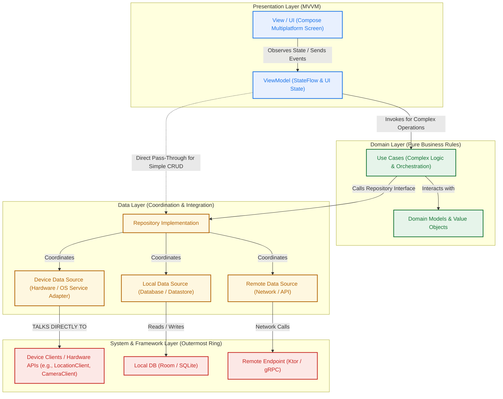
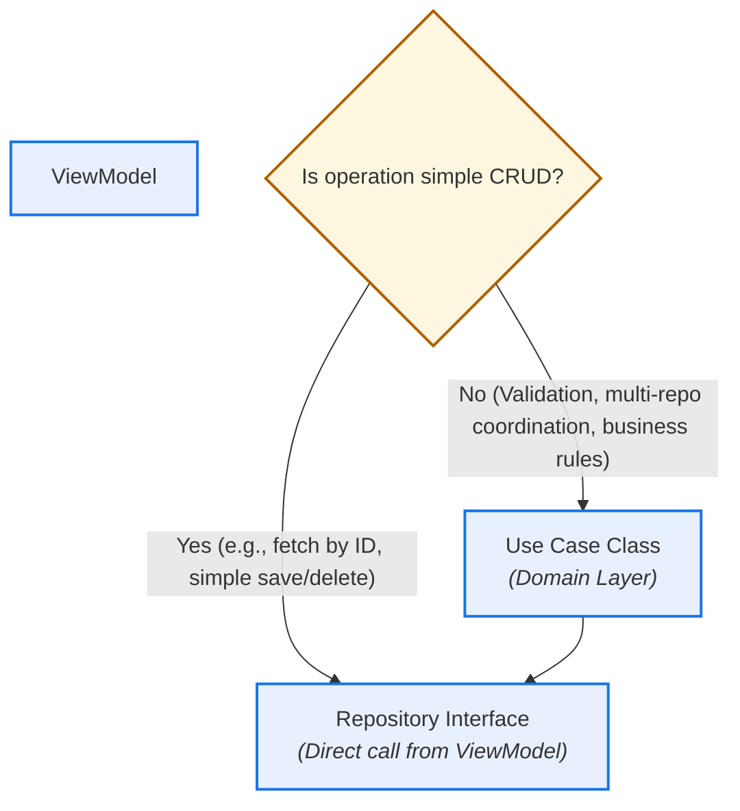
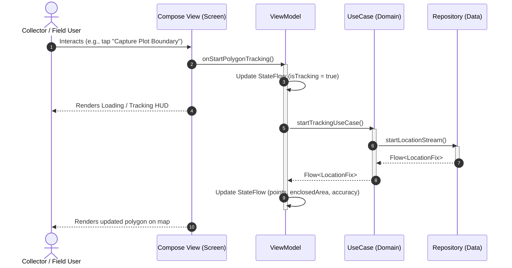
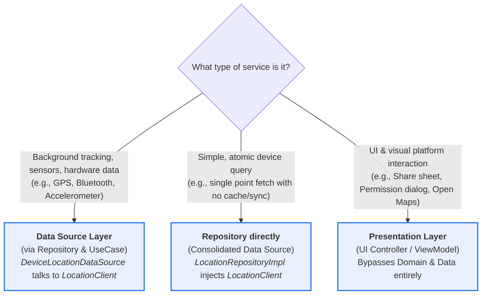

<!--
  Copyright 2026 The Ground Authors.

  Licensed under the Apache License, Version 2.0 (the "License");
  you may not use this file except in compliance with the License.
  You may obtain a copy of the License at

      https://www.apache.org/licenses/LICENSE-2.0

  Unless required by applicable law or agreed to in writing, software
  distributed under the License is distributed on an "AS IS" BASIS,
  WITHOUT WARRANTIES OR CONDITIONS OF ANY KIND, either express or implied.
  See the License for the specific language governing permissions and
  limitations under the License.
-->

# Ground 2.0 Architecture: Clean Architecture & MVVM in Kotlin Multiplatform

This document outlines how Ground 2.0 implements **Clean Architecture** and **Model-View-ViewModel (MVVM)** across Kotlin Multiplatform (KMP) and Compose Multiplatform (CMP). It establishes explicit layering boundaries, dependency rules, naming standards, and answers who can communicate directly with repositories and system/hardware service clients.

---

## 1. Core Principles & Motivation

Ground 2.0 is an offline-first, cross-platform geospatial data collection and monitoring platform targeting Android, iOS, and Web. Adopting Clean Architecture and MVVM provides critical engineering advantages:

1. **Strict Dependency Rule (Inward Dependencies)**: Dependencies point strictly inwards toward the core business domain. Inner layers know nothing about outer frameworks, databases, or UI toolkits.
2. **Platform Agnosticism**: Core business logic (form evaluation, validation, survey models, offline sync coordination) lives in pure Kotlin Multiplatform (`commonMain`) with zero platform-specific imports.
3. **Single Responsibility & Testability**: Business rules, state orchestration, data coordination, and hardware access are decoupled. Each layer is independently testable via unit tests without mocking UI or OS lifecycles.
4. **Predictable Unidirectional Data Flow (UDF)**: ViewModels expose immutable `StateFlow` streams observed by declarative Compose UI, while user interactions flow down as explicit events or intent methods.
5. **Pragmatic Complexity (CRUD vs. Business Logic)**: We avoid unnecessary boilerplate. Simple CRUD operations pass directly from ViewModels to Repositories. Dedicated Use Cases are introduced only when operations involve non-trivial business logic, multi-repository orchestration, validation, or complex data transformations.

### Relevant References & Specifications
- [The Clean Architecture (Robert C. Martin / Uncle Bob)](https://blog.cleancoder.com/uncle-bob/2012/08/13/the-clean-architecture.html)
- [Android Guide to App Architecture (Data Layer & Domain Layer)](https://developer.android.com/topic/architecture)
- [Android Architecture Recommendations: Domain Layer & Use Cases](https://developer.android.com/topic/architecture/domain-layer)
- [Android Architecture Recommendations: Data Layer](https://developer.android.com/topic/architecture/data-layer)
- [Ground 2.0 Multiplatform Architecture (`shared/README.md`)](../../../shared/README.md)
- [Ground 2.0 Shared Mobile Module (`shared/mobile/README.md`)](../../../shared/mobile/README.md)

---

## 2. High-Level Architectural Layers

The architecture is divided into three concentric Clean Architecture tiers, with the **Presentation Layer** structured according to **MVVM**:



### Layer Responsibilities

| Layer | Clean Layer | Components | Role & Responsibilities |
| :--- | :--- | :--- | :--- |
| **Presentation** | UI / Framework | Compose UI (`Screen`, `Card`, `Widget`), `ViewModel`, `UiState` | Implements MVVM. Collects user events, maintains screen state via `StateFlow<UiState>`, and coordinates actions. Direct CRUD operations pass through to Repositories; complex actions invoke Use Cases. |
| **Domain** | Use Cases / Entities | Use Cases, Domain Models, Repository Interfaces | Pure Kotlin (`commonMain`). Contains business entities, business rules, and defines repository contracts. Houses Use Cases for non-trivial orchestration. Has **no** knowledge of SQL, JSON, network APIs, or Android/iOS SDKs. |
| **Data** | Interface Adapters | Repository Implementations, Data Sources | Coordinates where data comes from (local database, remote server, or hardware sensors). Maps transport/storage models to clean Domain Models. |
| **Framework** | Frameworks & Drivers | Platform SDKs, SQLite, Ktor, Device Clients | External operating system capabilities, hardware drivers, and raw communication channels. |

---

## 3. The MVVM Pattern & Use Case Boundaries

The presentation tier adheres to strict **Model-View-ViewModel (MVVM)** with unidirectional data flow (UDF).

### The Rule for Use Cases vs. Direct Repository Access

To keep the architecture lean and avoid redundant boilerplate forwarding classes:

- **Simple CRUD Operations**: A ViewModel can call Repository interfaces directly for basic reads, writes, updates, and deletes (e.g., `surveyRepository.getSurvey(id)`, `draftRepository.deleteDraft(id)`, or observing `surveyRepository.surveyFlow`). Creating a Use Case that merely forwards a single method call to a repository adds no architectural value.
- **Complex Operations (Use Cases Required)**: Anything more complicated than simple CRUD **must** be encapsulated in a dedicated **Use Case** class in the Domain Layer. Examples include:
  - Combining or orchestrating multiple repositories (e.g., `SubmitSurveyResponseUseCase` coordinating validation, local entity mutations, and offline sync queueing).
  - Business rules, geometric computations, or algorithmic transformations (e.g., `ValidatePolygonBoundaryUseCase`, `ComputeWalkedAreaUseCase`).
  - Complex lifecycle or hardware stream coordination (e.g., `StartPolygonTrackingUseCase`).



### Unidirectional Data Flow Sequence



### MVVM Rules
1. **Views are Declarative and Passive**: Compose screens observe state via `collectAsStateWithLifecycle()` (or CMP equivalent) and dispatch user intents to ViewModel functions. Views contain no business decisions or algorithmic calculations.
2. **ViewModels Orchestrate Screen State**: ViewModels manage UI state and handle events. They delegate business rules to Use Cases and simple data storage/retrieval to Repositories. ViewModels never talk directly to Data Sources, Databases, or Device Clients.
3. **State Flows Down, Events Flow Up**: ViewModels expose immutable `StateFlow<ScreenUiState>` representations of screen state. Side effects (e.g., snackbars, navigation) use shared channels or single-event flows.

---

## 4. Communication with Device Services & Hardware APIs

A central architectural question in mobile engineering is: **Who can talk directly to device services and hardware wrappers (e.g., Location, Sensors, Camera, Bluetooth)?**

### Standard Rule: Only a Data Source Talks to Device Service Wrappers

In Clean Architecture, a device service wrapper represents an external framework dependency on the outermost ring. Therefore:
> **The only component that should talk directly to a device service client (e.g., `LocationClient`, `GnssHardwareClient`) is a specialized Data Source in the Data Layer.**

```mermaid
flowchart LR
    UC["Domain Layer<br/><b>LocationTrackingUseCase</b>"]
    REPO["Data Layer<br/><b>LocationRepositoryImpl</b>"]
    DS["Data Source Layer<br/><b>DeviceLocationDataSource</b>"]
    CLIENT["System Framework Wrapper<br/><b>LocationClient</b>"]
    OS["OS Native API<br/><i>(Android FusedLocation / iOS CoreLocation)</i>"]

    UC -->|"1. Invokes repository contract"| REPO
    REPO -->|"2. Coordinates source"| DS
    DS -->|"3. TALKS DIRECTLY TO"| CLIENT
    CLIENT -->|"4. Native calls"| OS

    classDef clean fill:#E6F4EA,stroke:#137333,stroke-width:2px;
    classDef warn fill:#FEF7E0,stroke:#B06000,stroke-width:2px;
    classDef danger fill:#FCE8E6,stroke:#C5221F,stroke-width:2px;

    class UC clean;
    class REPO,DS warn;
    class CLIENT,OS danger;
```



### Why We Standardize on Data Sources (and Avoid "Providers")

1. **Avoid "Provider" Ambiguity**: We intentionally avoid the term `Provider` (e.g., `LocationProvider`) because it is overloaded with design pattern baggage (the Provider pattern, ContentProvider, dependency injection provider factories). We prefer concrete, descriptive names:
   - System/Hardware Wrapper: `LocationClient`, `GnssClient`, `CameraClient`.
   - Data Source Adapter: `DeviceLocationDataSource`, `GnssLocationDataSource`.
2. **Data Mapping & Boundary Isolation**: System services return platform-specific data types (e.g., `android.location.Location` on Android or `CLLocation` on iOS). The presentation and domain layers must never import or observe these types. The **Data Source** acts as the isolation boundary, transforming platform objects into clean Kotlin domain value objects (e.g., `LocationFix(latitude, longitude, altitude, accuracy)`).
3. **Seamless Platform Swapping (KMP)**: In Kotlin Multiplatform, `LocationClient` defines a pure common interface in `commonMain`, while `androidMain` and `iosMain` provide native implementations using Android FusedLocationProvider and Apple CoreLocation respectively. Swapping platform implementations or providing test fakes requires touching only the framework/data source layer, leaving domain and presentation untouched.

---

## 5. Architectural Variations & Scope Boundaries

While the **Data Source** is the canonical Clean Architecture pattern for device and hardware services, two other patterns are recognized depending on service scope:



### 1. Data Source (Default for Data-Producing Services)
- **Scope**: Continuous streams, sensor polling, hardware data feeds (GNSS location, compass heading, camera frame capture, battery status).
- **Communication Path**: `UseCase` → `Repository` → `DataSource` → `DeviceClient`.
- **Reason**: Requires data mapping, buffering, or coordination with databases/sync queues.

### 2. Consolidated Repository (For Trivial / Atomic Operations)
- **Scope**: Trivial device queries where introducing a separate Data Source class would be redundant boilerplate (e.g., single one-off battery level check or simple screen orientation query).
- **Communication Path**: `UseCase` → `RepositoryImpl` → `DeviceClient`.
- **Constraint**: The `RepositoryImpl` directly performs the conversion from platform-specific types to domain models.

### 3. Presentation / UI Infrastructure (For Foreground UI Utilities)
- **Scope**: Visual platform interactions that do not produce domain data—such as opening the system share sheet, launching an external navigation intent (Google Maps), triggering native haptic feedback, or displaying OS runtime permission prompts.
- **Communication Path**: `View` / `ViewModel` → `UiPlatformLauncher` / `HapticFeedbackClient`.
- **Reason**: These are presentation/framework concerns that have no domain business logic and do not pass through the data layer.

---

## 6. Directory Structure & Module Placement

Within Ground 2.0, clean layering is mapped across KMP modules:

```text
├── shared/
│   ├── protos/           # Canonical Protocol Buffer schemas (ProtoForms, SurveyDef, DataRecords)
│   ├── core/             # Pure KMP Domain: XForms/XPath evaluator, reactive FormEngine
│   ├── ui/               # Shared CMP theme (GroundTheme), Question cards, Form wizard
│   └── mobile/           # Shared Android + iOS Mobile Engine
│       ├── domain/       # Use Cases, Domain Models, Repository Contracts
│       │   ├── model/
│       │   ├── repository/
│       │   └── usecase/  # Non-trivial orchestration & business logic
│       ├── data/         # Repositories, Data Sources, Database/Cache implementations
│       │   ├── datasource/
│       │   │   ├── local/
│       │   │   ├── remote/
│       │   │   └── device/   <-- DeviceLocationDataSource talks to LocationClient
│       │   └── repository/
│       ├── client/       # System/Hardware Client interfaces (expect/actual implementations)
│       │   ├── location/     <-- LocationClient interface in commonMain, actuals in platformMain
│       │   └── media/
│       └── ui/           # Mobile Compose screens, ViewModels (MVVM)
├── androidApp/           # Thin Android entry point, platform initialization, native permissions
├── iosApp/               # Thin iOS entry point, Xcode app wrapper (links GroundMobile.xcframework)
└── webApp/               # Compose Multiplatform Web application (WasmJS / JS)
```

---

## 7. Summary Checklist for Code Reviews

When authoring or reviewing Kotlin code in Ground 2.0, verify against this checklist:

- [ ] **Dependency Direction**: Do imports point inwards toward domain? No domain class imports classes from `data`, `ui`, `android.*`, or `platform.*`.
- [ ] **Pure Domain Models**: Does the domain layer use pure Kotlin data classes? Platform-specific objects (`android.location.Location`, `CLLocation`) must never cross into domain or presentation.
- [ ] **CRUD vs. Use Cases**: Are simple CRUD operations calling Repositories directly from ViewModels? Is anything with business logic, multi-repo orchestration, or validation placed in a dedicated Use Case?
- [ ] **No Direct Service Access from UI**: Do ViewModels or Views refrain from calling device clients directly? All data-producing hardware services are accessed via Data Sources.
- [ ] **Semantic Naming**: Are hardware wrappers named `Client` (e.g., `LocationClient`) rather than `Provider`? Are business classes named `UseCase` rather than `Interactor`?
- [ ] **Unidirectional Data Flow**: Do ViewModels expose immutable `StateFlow` and handle user events via functions?
- [ ] **Testing**: Can the UseCase and ViewModel be unit-tested using Kotlin test fakes without mocking Android/iOS framework classes?
