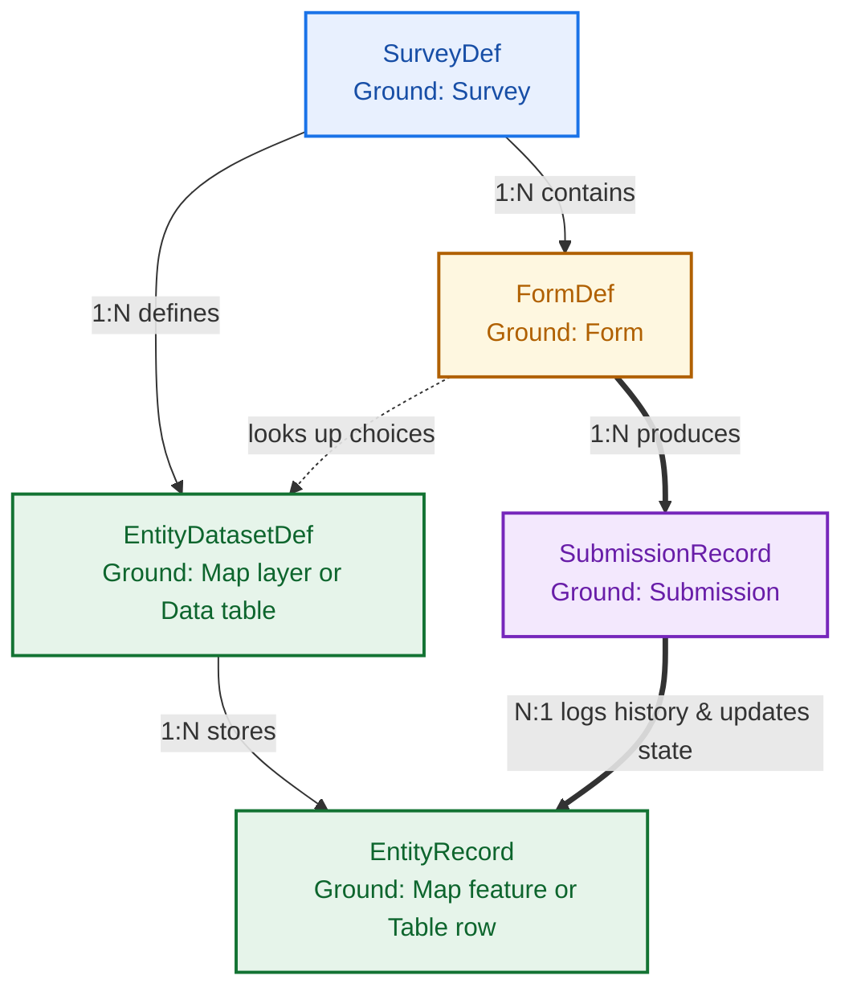

<!--
  Copyright 2026 The Ground Authors.

  Licensed under the Apache License, Version 2.0 (the "License");
  you may not use this file except in compliance with the License.
  You may obtain a copy of the License at

      https://www.apache.org/licenses/LICENSE-2.0

  Unless required by applicable law or agreed to in writing, software
  distributed under the License is distributed on an "AS IS" BASIS,
  WITHOUT WARRANTIES OR CONDITIONS OF ANY KIND, either express or implied.
  See the License for the specific language governing permissions and
  limitations under the License.
-->

# Ground 2.0 Data Model

The Ground 2.0 data model is defined as Protocol Buffer (`proto3`) schemas under [`shared/protos/`](../../../shared/protos/) across three packages: **`groundplatform.v2.survey`** (surveys, map layers, entity datasets, and access control), **`groundplatform.v2.forms`** (XForms/XLSForm-compatible form definitions), and **`groundplatform.v2.data`** (stateful entity records, immutable submission records, and audit logs).

At its core, the model separates **Current State** (**Map layers** and **Data tables**, represented by `EntityDatasetDef` and `EntityRecord`) from **Immutable Transactions** (**Forms** and **Submissions**, represented by `FormDef` and `SubmissionRecord`).

## Entity Relationship Overview

## Ground Concept Mapping

| Schema Message | Ground Concept | Description |
| :--- | :--- | :--- |
| **`SurveyDef`** | **Survey** | Top-level project container managing survey configuration, forms, map layers, data tables, and access control. |
| **`FormDef`** | **Form** | Questionnaire and encounter definition specifying questions, sections, skip logic, and validation rules *(replaces Ground 1.0 "Job")*. |
| **`EntityDatasetDef`** | **Map layer** (spatial) / **Data table** (tabular) | Master dataset schema defining attributes and geometry types for persistent real-world entities *(replaces Ground 1.0 "Site table")*. |
| **`EntityRecord`** | **Map feature** / **Table row** | Persistent real-world spatial feature (point, line, polygon) on the map or row in a data table, maintaining current state and workflow status *(replaces Ground 1.0 "Site / Location of Interest")*. |
| **`SubmissionRecord`** | **Submission** | Immutable historical encounter record capturing submitted answers, GPS coordinates, device metadata, and timestamps. Linked `N:1` to an `EntityRecord` to form its chronological timeline. |

## Core Relationships

- **Forms and Datasets (`FormDef` → `EntityDatasetDef`)**: Forms can populate a dataset (`CREATE` new entities), update an existing entity's properties and workflow status (`UPDATE` / `UPSERT`), or perform read-only choice lookups (`select_one_from_file`).
- **Submissions and Entities (`SubmissionRecord` → `EntityRecord`)**: Each completed form creates an immutable `SubmissionRecord`. When linked to an entity via `entity_id`, multiple submissions accumulate into that entity's chronological history timeline while updating its current attributes. Standalone forms produce submissions with no target entity.

## Model Specification Index

### Survey Configuration (`groundplatform.v2.survey`)

- **[Introduction](survey/00-introduction.md)**: Architectural overview of `groundplatform.v2.survey` and `groundplatform.v2.data`.
- **[Survey Structure](survey/01-survey-structure.md)**: `SurveyDef`, lifecycle states (`SurveyState`), and `FormLaunchConfig`.
- **[Entity Datasets and Schemas](survey/02-entity-datasets.md)**: `EntityDatasetDef`, `EntityType` (`TABULAR` vs. `GEOSPATIAL`), and `EntityPropertyDefinition`.
- **[Maps, Layers, and Geometry Styling](survey/03-maps.md)**: `MapConfig`, `LayerDef`, `GeometryStyle`, and `simplestyle-spec` overrides.
- **[Access Control Lists and Quotas](survey/04-access-control-and-quotas.md)**: `SurveyAcl`, `AclEntry`, `Role`, `SharingPolicy`, `PeerDataVisibility`, and `QuotaLimits`.

### Form Definitions & ProtoForms (`groundplatform.v2.forms`)

- **[Introduction](forms/00-introduction.md)**: ProtoForms overview and XForms/XLSForm round-trip compatibility.
- **[Structure](forms/01-structure.md)**: `FormDef`, `ModelDef`, `ViewDef`, and `RecordInstance` hierarchy.
- **[Namespaces](forms/02-namespaces.md)**: XML namespace preservation for XForms round-tripping.
- **[Instances](forms/03-instances.md)**: `PrimaryInstance`, `RecordSchema`, `FieldDefinition`, and `SecondaryInstance`.
- **[Bindings](forms/04-bindings.md)**: `FieldBinding` data types, skip logic, calculations, constraints, preloads, and `entity_saveto`.
- **[Body & Controls](forms/05-body.md)**: `ControlDef`, `ControlType`, `ChoiceItem`, `ItemsetDef`, and `GeoConfig`.
- **[Groups](forms/06-groups.md)** & **[Repeats](forms/07-repeats.md)**: `GroupDef` and `RepeatDef` containers.
- **[Events & Actions](forms/08-events.md)**: `ActionDef` and lifecycle `EventType` triggers.
- **[Translations](forms/09-translations.md)**, **[Media](forms/10-media.md)**, & **[URIs](forms/11-uri.md)**: `TranslationCatalog`, `LocalizedString`, `MediaRef`, and `jr://` URIs.
- **[Submission Configuration](forms/12-submission.md)** & **[Encryption](forms/16-encryption.md)**: `SubmissionConfig` and `EncryptedSubmissionManifest`.
- **[Compact Representation](forms/14-compact-representation.md)**: Compact SMS/text serialization.
- **[Client Audit Logs](forms/17-client-audit-logs.md)**: Question-level interaction telemetry (`AuditConfig`, `AuditLog`).
- **[Entities](forms/18-entities.md)**: `EntityDeclaration`, `EntityPropertyMapping`, and `EntitySyncMetadata`.

### Operational Data & Provenance (`groundplatform.v2.data`)

- **[Entity Records](data/01-entity-records.md)**: `EntityRecord` stateful instances, geometries, and properties.
- **[Submission Records](data/02-submission-records.md)**: `SubmissionRecord` transactions, `RecordMetadata`, and `RecordInstance` payloads.
- **[Audit Records and Provenance](data/03-audit-records.md)**: `AuditInfo`, `AuditRecord`, and `FieldDelta` mutation history.
