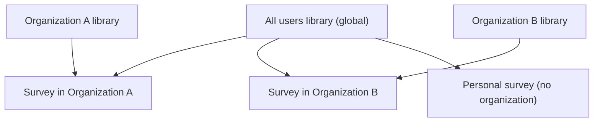

<!--
  Copyright 2026 The Ground Authors.

  Licensed under the Apache License, Version 2.0 (the "License");
  you may not use this file except in compliance with the License.
  You may obtain a copy of the License at

      https://www.apache.org/licenses/LICENSE-2.0

  Unless required by applicable law or agreed to in writing, software
  distributed under the License is distributed on an "AS IS" BASIS,
  WITHOUT WARRANTIES OR CONDITIONS OF ANY KIND, either express or implied.
  See the License for the specific language governing permissions and
  limitations under the License.
-->

# Introduction

The Ground 2.0 **library** (`groundplatform.v2.library`) defines reusable,
organization-owned building blocks for survey design and impact measurement:

*   **Concepts** (the **dictionary**): standard field definitions with a
    meaning, data type, unit, code list, aggregation rule, privacy class, and
    goal mapping. Form questions link to concepts so answers can be aggregated
    across surveys regardless of question wording or language.
*   **Form templates**: reusable forms whose questions may already be linked to
    concepts.
*   **Purpose Packs**: the purposes offered at survey creation ("What will this
    data be used for?"). Each bundles one or more templates with validation
    presets, export profiles, and goal mapping.
*   **Export profiles**: named exports with a fixed schema (e.g., EUDR GeoJSON).

See [Impact Measurement](../../../product/impact-measurement.md) for the
product rationale.

## Organization Libraries

Every [`Organization`](../survey/00-introduction.md) owns a library. The
synthetic **"All users"** organization (`org-all-users`) owns the **global
library**, which applies to every survey on the deployment. This mirrors how
platform-wide imagery sources are already held by "All users" and combined with
organization-specific sources.



## Resolution

When a survey is opened in the Survey Designer, its **resolved library** is
computed as follows:

*   **Survey in an organization**: the organization's entries, followed by the
    global entries, minus any global templates or Purpose Packs the
    organization has hidden (see
    [Templates and Purpose Packs](02-templates-and-purpose-packs.md#hiding-global-entries)).
*   **Personal survey (no organization)**: global entries only.

The following rules keep resolution simple and unambiguous:

*   **One-way references**: organization entries may reference global concepts,
    templates, and export profiles. Global entries never reference organization
    entries.
*   **No shadowing**: organization entry IDs always carry the prefix
    `org.<organization_id>.`, so an organization cannot redefine a global ID
    such as `eudr.commodity`. The prefix also makes every reference
    self-describing.
*   **Moving a survey between organizations**: references to the previous
    organization's concepts are preserved but reported by the form validator.
    Editors can copy the referenced concepts into the new organization's
    library to resolve them.

The library is used only by the Web Console's Survey Designer, which is
online-only. Mobile clients never load the library; they only carry concept
references embedded in forms, which the form engine ignores at runtime.

## Permissions

| Library | Who can edit | Notes |
| :--- | :--- | :--- |
| Organization library | Active `MANAGER` members of the organization | Same role that manages members and imagery sources |
| Global library ("All users") | Active `MANAGER` members of "All users" | These Managers are the deployment's platform admins |

"All users" membership has the following special rules:

*   **Implicit membership**: every user is implicitly a read-only member of "All
    users". Users cannot leave, request to join, or be invited with the `MEMBER`
    role, and the organization is not listed in the public directory.
*   **Limited scope**: "All users" Managers curate global library entries and
    platform-wide imagery sources only. The role grants no access to other
    organizations' surveys or data.
*   **Bootstrap**: the first "All users" Manager is set by deployment
    configuration. After that, the standard invitation flow and the rule that
    the last Manager cannot be removed or demoted apply.
*   **Server-side enforcement**: writes to the global library are authorized by
    server-side rules, not only by the client UI.

## Lifecycle and Auditing

*   Concepts and Purpose Packs carry a `status` (`DRAFT`, `STABLE`,
    `DEPRECATED`). New global entries start as `DRAFT` and are published
    explicitly. Deprecated entries are hidden from pickers and autocomplete,
    while existing references keep working.
*   All library mutations are recorded in the audit log
    ([Audit Records and Provenance](../data/03-audit-records.md)).
*   On a new deployment, the global library is bootstrapped from the seed files
    `shared/assets/library/<vocabulary>.textproto` (vocabularies `core`,
    `eudr`, `ferm`, `pame`, `iplc`, `lulc`, and `timber`). Each file is one
    `LibraryBundle` and omits `organization_id`, which the loader sets to the
    "All users" organization. After bootstrap, the "All users" library is the
    source of truth.

## Package and File Architecture

Library schemas reside under `shared/protos/library/` in the
`groundplatform.v2.library` package:

*   **`library/concept.proto`**: `LocalizedText`, `ConceptDef`, `CodeList`,
    `CodeListItem`, `Aggregation`, `PrivacyClass`, `Pillar`, and
    `LibraryStatus`.
*   **`library/template.proto`**: `FormTemplateDef`.
*   **`library/purpose_pack.proto`**: `PurposePackDef` and `ExportProfileDef`.
*   **`library/library_settings.proto`**: `OrganizationLibrarySettings`.
*   **`library/library_bundle.proto`**: `LibraryBundle`, a set of entries
    exchanged as one unit: the top-level message of each seed file, and of
    library imports and exports.

```protobuf
message LibraryBundle {
  repeated ConceptDef concepts = 1;
  repeated FormTemplateDef form_templates = 2;
  repeated PurposePackDef purpose_packs = 3;
  repeated ExportProfileDef export_profiles = 4;
}
```

`LibraryTextProtoSerializer` (in `shared/core`) reads and writes bundles and
library settings as Protocol Buffer Text Format.

Entries are stored as per-organization collections
(`organizations/{organization_id}/concepts`, `/form_templates`,
`/purpose_packs`, `/export_profiles`) rather than inline on `Organization`, so
organization documents stay small.

## Specification Index

*   **[Concepts and the Dictionary](01-concepts.md)**: `ConceptDef`, code lists,
    IDs and versioning, linking form fields (`ConceptRef`), and XForms/XLSForm
    serialization.
*   **[Templates and Purpose Packs](02-templates-and-purpose-packs.md)**:
    `FormTemplateDef`, `PurposePackDef`, `ExportProfileDef`, survey purposes,
    and hiding global entries.
